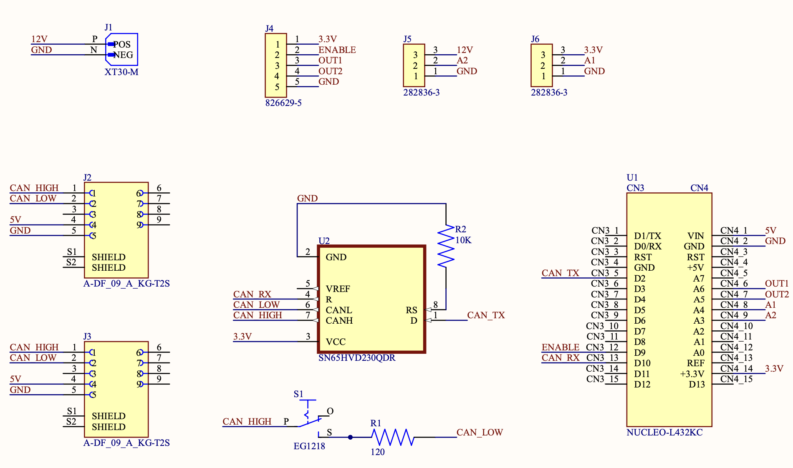
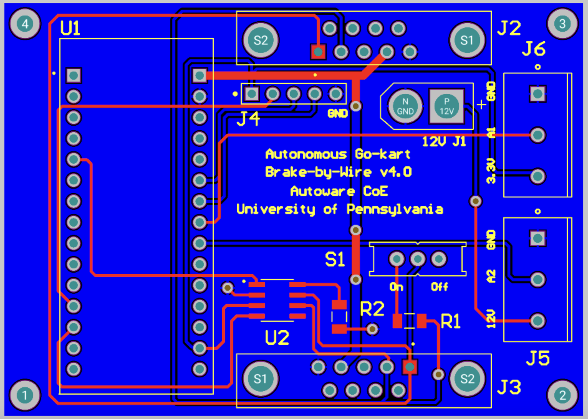

Brake-by-Wire Subsystem
-----------------------

Traditional braking systems use a hydraulic mechanism to decelerate a vehicle. The Brake-by-Wire (BBW) system replaces this with electronic controls to provide braking functionalities. This electronic braking mechanism ensures that the braking process is more precise, efficient, and adaptable to various driving conditions.

Brake-by-Wire
~~~~~~~~~~~~~~~~~~~

The UBBW is a sophisticated braking control system without any mechanical connection between the brake pedal and the vehicle's braking mechanisms. This system incorporates electronic controllers, actuators, and sensors to give necessary braking feedback and control. The BBW's Nucleo interfaces with the CAN bus to receive desired braking intensities and transmit current braking data. It uses the settings from SPI2 for external communications and CAN2 for internal communications. One of the vital components of this design is the emergency braking mechanism that allows the driver to manually override the system in any failure scenario.

Bill of Materials: https://docs.google.com/spreadsheets/d/1DgbnX_rlhYMLlgsNeylGjvJf8VsjunWTmRLXtc9lVjU/edit?usp=sharing

img1: schematic of the  rake-by-wire subsystem 

img2: PCB of the brake-by-wire subsystem 

Code Structure Overview
~~~~~~~~~~~~~~~~~~~~~~~

1. **Introduction**
   Residing within an STM32 microcontroller, this software operates the brake-by-wire subsystem of the vehicle. It interprets braking commands from the CAN bus, determines the required braking intensity, and communicates this data over the CAN network. The system integrates several hardware components, such as GPIOs for braking position, USART3 and USART4 for serial communication, and CAN2 for network communication.

2. **Initialization**
   The initial segment of the code initializes the system clock and vital hardware peripherals - USART3, USART4, CAN2, SPI2, and timers TIM8, TIM9, and TIM17. Post initialization, these peripherals manage the system's communication and timing tasks.

3. **Key Variables and Structures**
   Various structures and variables are employed for SPI communication, CAN communication (``CAN_TxHeaderTypeDef``, ``CAN_RxHeaderTypeDef``), UART communication (``huart3``, ``huart4``), CAN network management (``hcan2``), and timer operations (``htim8``, ``htim9``, and ``htim17``). Some variables store values associated with braking intensity, position, and sensor data.

4. **CAN Reception and Processing**
   The ``HAL_CAN_RxFifo1MsgPendingCallback`` function, serving as an interrupt handler, is activated upon the arrival of a new CAN message. This function extracts the required braking intensity and any additional relevant data from the incoming CAN message.

5. **Timer Callbacks and Operations**
   The ``HAL_TIM_PeriodElapsedCallback`` function is invoked when a timer interval concludes. Depending on the timer instance, operations related to braking adjustments, sensor data collection, or braking calculations and CAN transmissions occur.

6. **UART Write Function**
   For debugging purposes, the ``_write`` function overwrites the default write function, facilitating UART3 and UART4 data transmissions.

7. **System Clock Configuration**
   The ``SystemClock_Config`` function, often autogenerated by STM32CubeMX, contains the system clock configurations.

8. **CAN Initialization**
   The ``MX_CAN2_Init`` function oversees the CAN bus initialization, defining parameters like DLC, Identifier types, Frame types, etc.

9. **Braking Logic Implementation**
   This section, crucial to the operation of the Brake-by-Wire system, contains the core logic determining how braking actions are executed based on incoming CAN messages. Algorithms, PID controllers, or other control logic to adjust the braking intensity reside here.

10. **Sensor Data Handling**
    Given the importance of real-time feedback in braking systems, this section details how sensor data (like wheel speed or brake pad wear) are processed and integrated into the braking logic. Decisions, such as the need to increase braking pressure or adjust for changing conditions, leverage this sensor data.

11. **Error Handling and Diagnostics**
    In any safety-critical system, proper error handling is paramount. This section is dedicated to identifying, handling, and reporting errors. From simple software glitches to potential hardware malfunctions, this segment ensures that the system can gracefully handle issues and, when necessary, revert to a safe state.

12. **Emergency Override Mechanism**
    The manual override or emergency braking function is detailed here. It ensures that, in the case of any malfunction in the Brake-by-Wire system, the driver can still exert control and bring the vehicle to a stop.

13. **Feedback Loop to Driver**
    Since tactile feedback is crucial for a driver used to traditional braking systems, this section elaborates on how feedback is provided. Whether it's through haptic feedback on the brake pedal or auditory signals, this mechanism ensures that the driver is aware of the braking actions being taken.

14. **Power Management**
    Efficient power management ensures that the Brake-by-Wire system operates even under low battery conditions. This section describes how the system manages its power consumption and the measures taken to guarantee its operation in different vehicle states.

15. **Conclusion and Testing**
    Summarizing the Brake-by-Wire system's functionalities, this section underscores its benefits and potential drawbacks. Also, it lays out the testing methods employed to guarantee the system's safety and reliability. These can include both simulation tests and real-world braking scenarios.

