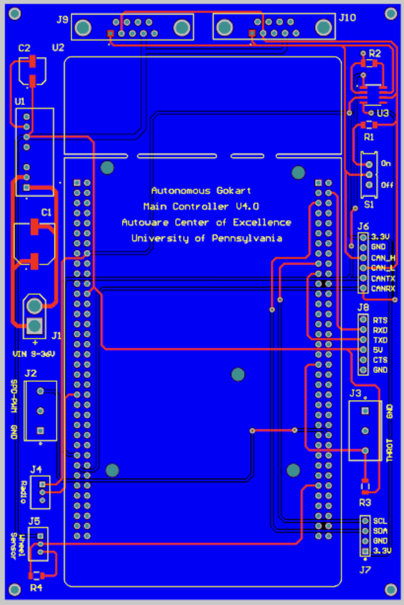

Control Systems 
================

Except the Power Distrubtion System, we still have five control unit, Main Control (MC), User Interface (UI),
Throttle-by-Wire (TBW), Brake-by-Wire (BBW), and Steerby-Wire (SBW), they make up our control system. 

.. image:: vertopal_89473492f87843d38ce69ba576e4f6e0/media/Control_System_Main.png

All Codes and PCBs are in the Github Link:
https://github.com/mlab-upenn/gokart-mechatronics

The MC handles all the driving requests from the high-level end and sends out those commands (throttle, steering, brake)
on the CAN bus. It serves as an interface between the go-kart mechatronic system and the end user. Three different operation
modes are supported: manual, remote, and autonomous. In the manual mode, input is read from the steering wheel, throttle,
and brake pedals of a driver just like in any conventional vehicle. In the remote mode, the operator uses a Spektrum
DX6 2.4GHz radio to send the driving commands, which are received by the MC using an AR6200 receiver. In the
autonomous mode, the command is transmitted from a highlevel computing unit such as a laptop or a specialized onboard computer, 
through a USB to TTL communication. 
                    

Throttle-by-Wire Subsystem
---------------------------

The TBW is a specially-designed PCB mounted on the side of the driver’s seat, controlling the go-kart’s main drive motor. The TBW’s Nucleo interfaces with the CAN bus to receive desired speed values and to transmit measured speeds. The speed measurement utilizes a hall effect wheel speed sensor positioned near the go-kart’s rear shaft. Speed modulation is facilitated through a closed-loop PID mechanism. The Nucleo emits a PWM signal of variable duty cycle, which is then converted to a 0-5V analog signal. This analog signal is channeled to the Alltrax SR48300 DC Motor Controller, governing speed control. Another noteworthy design element is the remote kill switch. This allows the operator to remotely halt power in emergencies. Realized through a remote relay, this switch can interrupt power delivery to the main motor, serving as an independent safety feature even in the event of a worst-case system malfunction.

.. image:: img/TBW_PCB.png

Code Structure Overview
~~~~~~~~~~~~~~~~~~~~

1. **Introduction**
   Embedded within an STM32 microcontroller, the software drives the throttle-by-wire subsystem of a vehicle. It processes throttle commands and motor directions from the CAN bus, computes vehicle speed, and returns this data on the CAN network. The system also generates a PWM signal for motor speed control, utilizing a plethora of hardware components including GPIOs, USART2 for serial communication, CAN1 for network communication, and multiple timers.

2. **Initialization**
   The code's preliminary segment initializes the system clock and vital hardware peripherals - USART2, CAN1, and timers like TIM1, TIM6, TIM7, and TIM16. These peripherals, once initialized, play a pivotal role in the system's functionality, overseeing communication and timing tasks.

3. **Key Variable and Structures**
   A plethora of structures and variables are instantiated to facilitate CAN communication (`CAN_TxHeaderTypeDef`, `CAN_RxHeaderTypeDef`), UART communication (`huart2`), CAN network management (`hcan1`), and timer handling (`htim1`, `htim6`, `htim7`, and `htim16`). Additionally, certain variables retain values pertaining to motor direction, throttle magnitude, speed sensor readings, and computed speeds.

4. **CAN Reception and Processing**
   The `HAL_CAN_RxFifo0MsgPendingCallback` function, acting as an interrupt handler, is invoked when a fresh CAN message arrives. Within this handler, the throttle magnitude and motor direction are derived from the incoming CAN data.

5. **Timer Callbacks and Operations**
   The `HAL_TIM_PeriodElapsedCallback` function is activated upon the lapse of a timer duration. Depending on the timer instance, operations like motor speed modulation via PWM, speed sensor reading capture, or speed computation and CAN transmission are performed.

6. **UART Write Function**
   Primarily for debugging, the `_write` function supplants the default write function, enabling UART2 data transmission.

7. **System Clock Configuration**
   The system clock configuration resides within the `SystemClock_Config` function, typically autogenerated by STM32CubeMX.

8. **CAN Initialization**
   The `MX_CAN1_Init` function orchestrates CAN bus setup, defining parameters such as DLC, Identifier types, Frame types, and more.

                    
                 

Steer-by-Wire Subsystem
---------------------------

                    The original unmodified go-kart platform uses an alloy shaft to connect the steering wheel 
                    and the front wheel. Steering is made possible entirely through the driver’s torque input. 
                    In order to provide an autonomous mode, a motor must be added to actuate the steering. Several 
                    design ideas have been composed: one attempt was to mount the motor parallel to the steering shaft 
                    and use a belt or chain for motion transmission.

Upper Steer-by-Wire 
~~~~~~~~~~~~~~~~~~~~
                    The USbW is a unique PCB mounted near the steering column. This module controls the go-kart's steering mechanism. 
The USbW’s Nucleo receives the desired steering angle from the CAN bus and sends out the current steering position. 
Angle measurement is done using a rotary encoder fitted directly to the steering shaft. Steering control is 
implemented using a closed-loop PID control. The Nucleo outputs a PWM signal, which is then converted into a 
0-5V analog voltage. This voltage is fed into the AdvancedSteer SR50x00 DC Motor Controller to adjust the 
steering angle. An additional feature is the manual override, allowing the driver to take over steering control 
instantly. This feature uses a toggle switch and bypasses the electronic system, ensuring safety in the event of 
an electronic malfunction.

.. image:: img/USBW_PCB.png

Code Structure Overview
~~~~~~~~~~~~~~~~~~~~

1. **Introduction**
   The software is tailored for STM32 microcontrollers, acting as the brain of an Upper Steer-by-Wire system. 
   It processes steering instructions received from the CAN bus, calculates the current steering angle, and 
   sends feedback via the CAN bus. It also outputs a PWM signal for steering adjustment. The design integrates 
   various hardware components, including GPIOs, USART2 for debugging, CAN1 for inter-device communication, 
   and several timers.

2. **Initialization**
   The first step in the code establishes the system clock and activates essential peripherals such as USART2, 
   CAN1, and timers - TIM2, TIM3, TIM8, and TIM17. These initialized modules are fundamental to the system’s 
   operation, managing data transmission and system timing.

3. **Key Variable and Structures**
   Various structures and variables support CAN communication (`CAN_TxHeaderTypeDef`, `CAN_RxHeaderTypeDef`), 
   UART communication (`huart2`), CAN interface (`hcan1`), and timer modules (`htim2`, `htim3`, `htim8`, 
   and `htim17`). Variables also store the steering angle, desired steering position, encoder readings, 
   and more.

4. **CAN Reception and Processing**
   The `HAL_CAN_RxFifo0MsgPendingCallback` function acts as an ISR (Interrupt Service Routine) that's 
   triggered whenever there’s a new message on the CAN bus. This handler extracts the desired steering angle 
   from the CAN data.

5. **Timer Callbacks and Operations**
   The `HAL_TIM_PeriodElapsedCallback` is activated when a timer expires. Depending on the timer instance, 
   tasks like adjusting the steering angle using PWM, reading encoder values, or sending current steering 
   position via CAN are executed.

6. **UART Write Function**
   To aid in debugging, the `_write` function is customized to send data via USART2, replacing the standard 
   output function.

7. **System Clock Configuration**
   The `SystemClock_Config` function, generally produced by STM32CubeMX, sets up the system clock.

8. **CAN Initialization**
   `MX_CAN1_Init` function sets up the CAN bus. This includes parameters such as DLC, Identifier type, Frame 
   type, and more.

Lower Steer-by-Wire 
~~~~~~~~~~~~~~~~~~~~

The SBW is an advanced steering control mechanism, devoid of any mechanical linkage between the steering wheel and the vehicle's wheels. Instead, it employs electronic controllers, actuators, and sensors to provide the necessary steering feedback and control. The SBW's Nucleo interfaces with the CAN bus to receive desired steering angles and to transmit current steering data. It utilizes the provided configuration settings, especially from SPI1 for external communications and CAN1 for internal communications. An essential design component is the emergency steering mechanism that ensures the driver can override the system manually in case of any malfunction.

.. image:: img/LSBW_PCB.png

Code Structure Overview
~~~~~~~~~~~~~~~~~~~~

1. **Introduction**
   Situated within an STM32 microcontroller, the software powers the steer-by-wire subsystem of the vehicle. It comprehends steering commands from the CAN bus, calculates the desired steering angle, and retransmits this data over the CAN network. The system also benefits from multiple hardware components, such as GPIOs for steering position, USART1 and USART2 for serial communication, and CAN1 for network communication.

2. **Initialization**
   The initial part of the code sets up the system clock and essential hardware peripherals - USART1, USART2, CAN1, SPI1, and timers TIM6, TIM7, and TIM16. After initialization, these peripherals govern the entirety of the system's communication and timing processes.

3. **Key Variables and Structures**
   A multitude of structures and variables are employed to facilitate SPI communication, CAN communication (`CAN_TxHeaderTypeDef`, `CAN_RxHeaderTypeDef`), UART communication (`huart1`, `huart2`), CAN network management (`hcan1`), and timer operations (`htim6`, `htim7`, and `htim16`). Certain variables hold values related to the steering angle, force, position, and sensor readings.

4. **CAN Reception and Processing**
   The `HAL_CAN_RxFifo0MsgPendingCallback` function, acting as an interrupt handler, springs into action upon the reception of a new CAN message. Within this function, the desired steering angle and force are extracted from the incoming CAN data.

5. **Timer Callbacks and Operations**
   The `HAL_TIM_PeriodElapsedCallback` function is triggered once a timer duration expires. Depending on the timer instance, operations related to steering angle adjustments, sensor reading captures, or steering angle computations and CAN transmissions take place.

6. **UART Write Function**
   Primarily for debugging purposes, the `_write` function replaces the default write function, facilitating UART1 and UART2 data transmissions.

7. **System Clock Configuration**
   The `SystemClock_Config` function, often autogenerated by STM32CubeMX, encapsulates the system clock settings.

8. **CAN Initialization**
   The `MX_CAN1_Init` function masterminds the CAN bus initialization, detailing parameters like DLC, Identifier types, Frame types, and others.

Main Control Subsystem
-----------------------

The Main Control Unit (MCU) stands as the central nerve of the go-kart's electronic framework. Its primary function is to coordinate all sub-systems, ensuring smooth and cohesive operations. The MCU's processor interfaces directly with the CAN bus, serving as the hub for both incoming and outgoing data transmissions. Notably, it collects, processes, and disseminates a multitude of data points, ranging from throttle input to motor parameters and speed sensor feedback. This data is crucial for the calibration and adjustment of several control algorithms, including the PID control for speed regulation. Furthermore, the MCU regulates power distribution across the kart, ensuring optimal energy management. An intrinsic safety feature within the MCU is its capability to detect anomalies in real-time and engage contingency measures. For instance, it can autonomously cut off power or apply brakes under predefined risk scenarios. Beyond real-time operations, the MCU also stores data logs for post-operation analysis, facilitating continuous improvement and troubleshooting.

Code Structure Overview
~~~~~~~~~~~~~~~~~~~~~~~~

1. **Introduction**
   At the heart of the system, the software embedded in the MCU oversees and manages every sub-system of the go-kart. It harmonizes data streams from various sources, makes pivotal real-time decisions, and communicates operational directives to the relevant sub-systems via the CAN network.

2. **Initialization**
   At startup, the code initializes the system clock, setting the heartbeat for the entire go-kart. Concurrently, essential hardware peripherals get initialized, preparing them for their respective operational tasks.

3. **Key Variable and Structures**
   To manage the sheer volume of data and commands, several structures and variables are declared. These include components for CAN communication, data storage arrays for parameters like throttle position, battery status, motor temperature, and more.

4. **CAN Message Management**
   To ensure streamlined communication, the ``CAN_MsgHandler`` function is pivotal. This function listens, decodes, and routes incoming CAN messages while also packaging and sending outgoing CAN data.

5. **Safety Checks and Measures**
   A vital aspect of the MCU's software is continuous monitoring for anomalies. Functions like ``SafetyCheck`` and ``EmergencyResponse`` are always on the lookout for potential hazards, ready to engage safety protocols instantaneously.

6. **Data Logging and Retrieval**
   The ``DataLog`` function stores key operational parameters during the drive. Later, using the ``DataRetrieve`` function, this data can be accessed for analysis and optimization.

7. **Power Management**
   Power distribution and management are crucial for both performance and safety. The ``PowerManager`` function ensures that every sub-system receives the requisite power without any undue stress on the battery.

8. **Sensor Feedback Loop**
   Sensors provide valuable insights into real-time operations. The ``SensorFeedbackHandler`` function constantly monitors sensor outputs, making adjustments as necessary for optimal performance.

9. **External Communication Interface**
   For external control or monitoring, the ``ExternalCommInterface`` function facilitates communication, be it via Bluetooth, Wi-Fi, or any other mode.

10. **System Shutdown and Reset**
   At the end of an operation or in case of critical failures, the ``SystemShutdown`` function ensures a safe and controlled shutdown. If necessary, the ``SystemReset`` function can reboot the system, restoring default settings.

                

