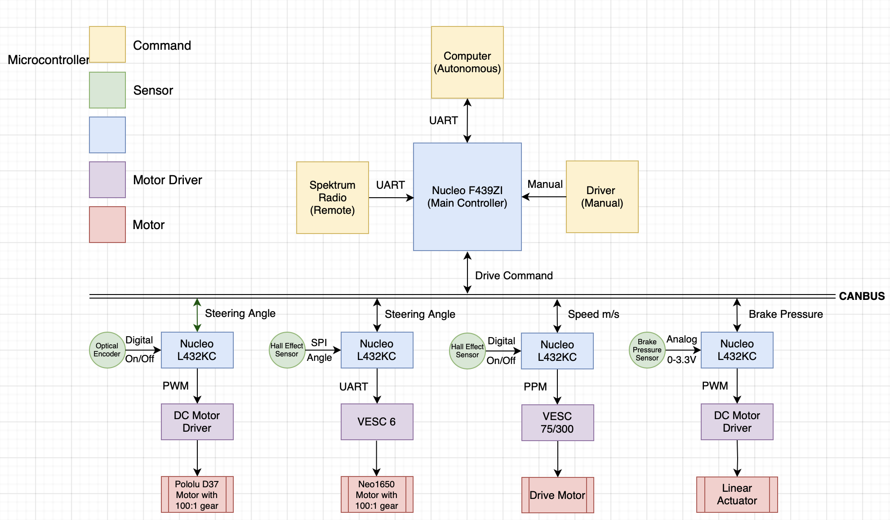

Control Systems 
================

The go-kart mechatronics system is designed as a modular
system, consisting of several subsystems that are responsible
for different tasks. There are six major subsystems: Power
Distribution (PD), Main Control (MC), User Interface (UI),
Throttle-by-Wire (TBW), Brake-by-Wire (BBW), and Steerby-Wire (SBW). The “x-by-wire” system design approach has
been gaining popularity in the automotive industry which is to
replace conventional mechanical and hydraulic control systems
with electronic signals. The elimination of traditional
mechanical components could increase control stability, increase design flexibility, reduce cost, and improve efficiency. In our go-kart drive-by-wire design, all subsystems
except the PD use an STM32 Nucleo development board on
a standalone PCB as the electronic control unit (ECU). Like
modern vehicle design, communication is achieved using the
controller area network (CAN) to allow efficient information
exchange between nodes. These modular control systems
are integrated with the original go-kart chassis in a nonintrusive manner and are easy to understand, build, and modify.

All Codes and PCBs are in the Github Link:
https://github.com/mlab-upenn/gokart-mechatronics

The MC handles all the driving requests from the high-level end and sends out those commands (throttle, steering, brake)
on the CAN bus. It serves as an interface between the go-kart mechatronic system and the end user. Three different operation
modes are supported: manual, remote, and autonomous. In the manual mode, input is read from the steering wheel, throttle,
and brake pedals of a driver just like in any conventional vehicle. In the remote mode, the operator uses a Spektrum
DX6 2.4GHz radio to send the driving commands, which are received by the MC using an AR6200 receiver. In the
autonomous mode, the command is transmitted from a highlevel computing unit such as a laptop or a specialized onboard computer, 
through a USB to TTL communication. 
                                        
                 

