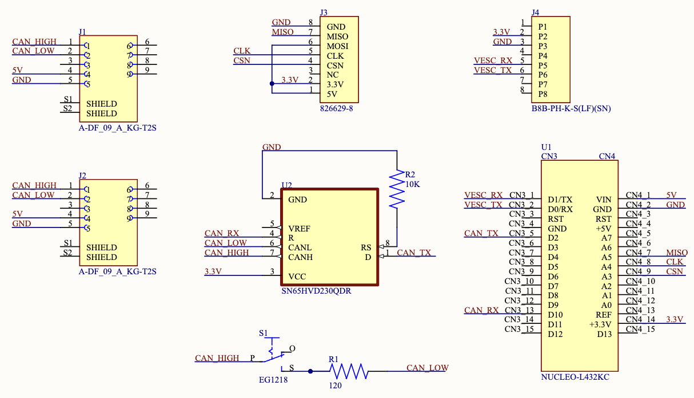
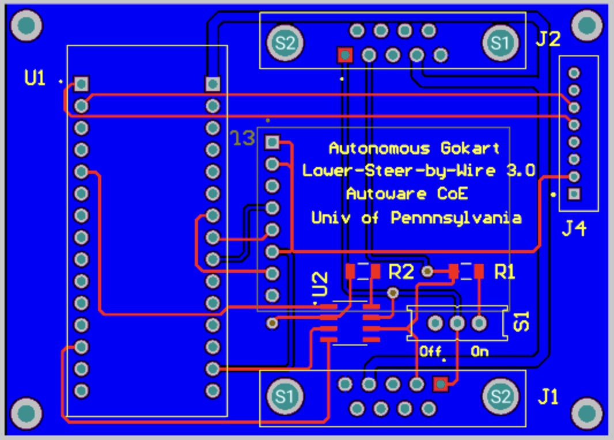

Lower Steer-by-Wire Electrical Subsystem
---------------------------

The original unmodified go-kart platform uses an alloy shaft to connect the steering wheel 
and the front wheel. Steering is made possible entirely through the driver’s torque input. 
In order to provide an autonomous mode, a motor must be added to actuate the steering. Several 
design ideas have been composed: one attempt was to mount the motor parallel to the steering shaft 
and use a belt or chain for motion transmission.

Lower Steer-by-Wire 
~~~~~~~~~~~~~~~~~~~~

The LSBW is an advanced steering control mechanism, devoid of any mechanical linkage between the steering wheel and the vehicle's wheels. Instead, it employs electronic controllers, actuators, and sensors to provide the necessary steering feedback and control. The SBW's Nucleo interfaces with the CAN bus to receive desired steering angles and to transmit current steering data. It utilizes the provided configuration settings, especially from SPI1 for external communications and CAN1 for internal communications. An essential design component is the emergency steering mechanism that ensures the driver can override the system manually in case of any malfunction.

`Bill of Materials <https://docs.google.com/spreadsheets/d/1CsiUmrrMaJ-pRY2qe5Y_F48-POgX1hK238BuJREWO30/edit?usp=drive_link>`_

img1: schematic of the lower steer-by-wire subsystem   
   

 

img2: PCB of the lower steer-by-wire subsystem 

Code Structure Overview
~~~~~~~~~~~~~~~~~~~~

1. **Introduction**
   Situated within an STM32 microcontroller, the software powers the steer-by-wire subsystem of the vehicle. It comprehends steering commands from the CAN bus, calculates the desired steering angle, and retransmits this data over the CAN network. The system also benefits from multiple hardware components, such as GPIOs for steering position, USART1 and USART2 for serial communication, and CAN1 for network communication.

2. **Initialization**
   The initial part of the code sets up the system clock and essential hardware peripherals - USART1, USART2, CAN1, SPI1, and timers TIM6, TIM7, and TIM16. After initialization, these peripherals govern the entirety of the system's communication and timing processes.

3. **Key Variables and Structures**
   A multitude of structures and variables are employed to facilitate SPI communication, CAN communication (``CAN_TxHeaderTypeDef``, ``CAN_RxHeaderTypeDef``), UART communication (``huart1``, ``huart2``), CAN network management (``hcan1``), and timer operations (``htim6``, ``htim7``, and ``htim16``). Certain variables hold values related to the steering angle, force, position, and sensor readings.

4. **CAN Reception and Processing**
   The ``HAL_CAN_RxFifo0MsgPendingCallback`` function, acting as an interrupt handler, springs into action upon the reception of a new CAN message. Within this function, the desired steering angle and force are extracted from the incoming CAN data.

5. **Timer Callbacks and Operations**
   The ``HAL_TIM_PeriodElapsedCallback`` function is triggered once a timer duration expires. Depending on the timer instance, operations related to steering angle adjustments, sensor reading captures, or steering angle computations and CAN transmissions take place.

6. **UART Write Function**
   Primarily for debugging purposes, the ``_write`` function replaces the default write function, facilitating UART1 and UART2 data transmissions.

7. **System Clock Configuration**
   The ``SystemClock_Config`` function, often autogenerated by STM32CubeMX, encapsulates the system clock settings.

8. **CAN Initialization**
   The ``MX_CAN1_Init`` function masterminds the CAN bus initialization, detailing parameters like DLC, Identifier types, Frame types, and others.
