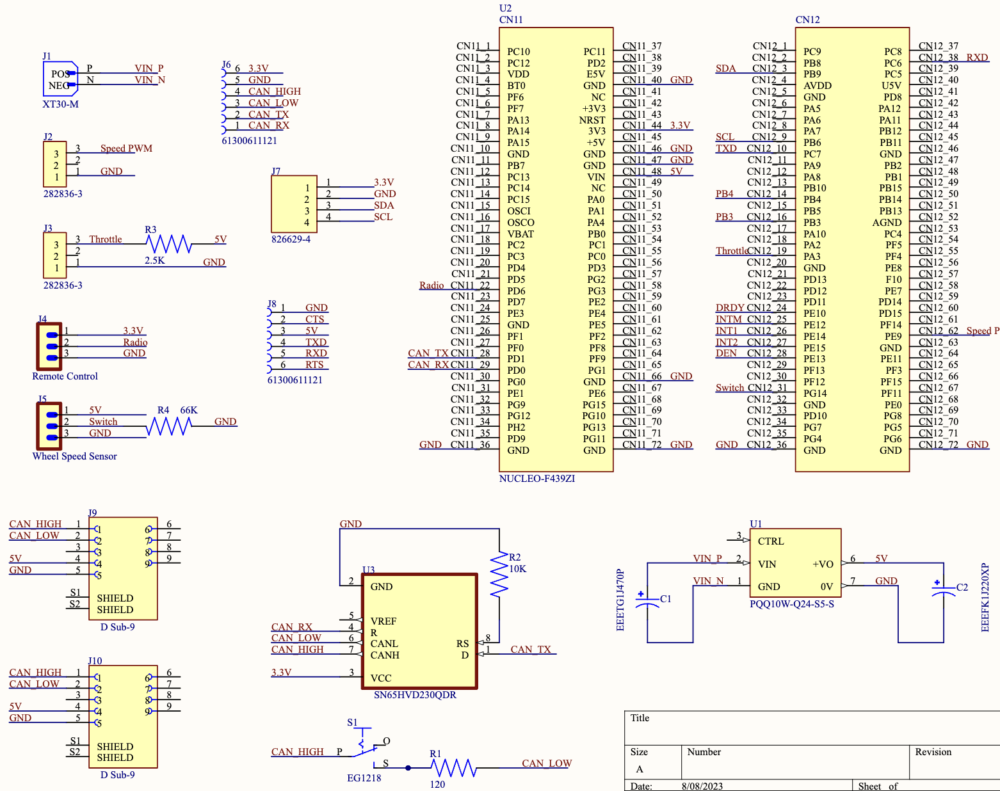
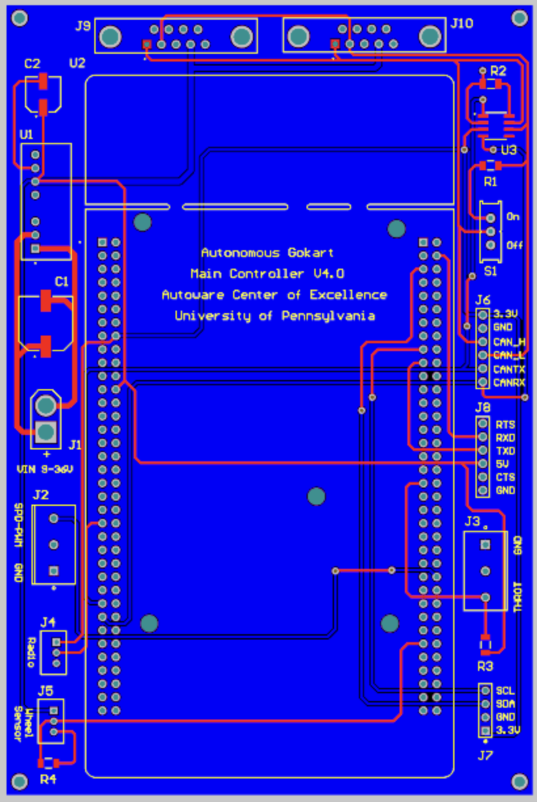

Main Control Subsystem
-----------------------

The Main Control Unit (MCU) stands as the central nerve of the go-kart's electronic framework. Its primary function is to coordinate all sub-systems, ensuring smooth and cohesive operations. The MCU's processor interfaces directly with the CAN bus, serving as the hub for both incoming and outgoing data transmissions. Notably, it collects, processes, and disseminates a multitude of data points, ranging from throttle input to motor parameters and speed sensor feedback. This data is crucial for the calibration and adjustment of several control algorithms, including the PID control for speed regulation. Furthermore, the MCU regulates power distribution across the kart, ensuring optimal energy management. An intrinsic safety feature within the MCU is its capability to detect anomalies in real-time and engage contingency measures. For instance, it can autonomously cut off power or apply brakes under predefined risk scenarios. Beyond real-time operations, the MCU also stores data logs for post-operation analysis, facilitating continuous improvement and troubleshooting.

Bill of Matreials: https://docs.google.com/spreadsheets/d/1RsJtWkHKiKtcIdIF5GS_IMLmA9pXeHQMcQNAkUHgcUQ/edit?usp=drive_link

    
img1: Schematic of the MCU

   
img2: PCB of the MCU

Code Structure Overview
~~~~~~~~~~~~~~~~~~~~~~~~

1. **Introduction**
   At the heart of the system, the software embedded in the MCU oversees and manages every sub-system of the go-kart. It harmonizes data streams from various sources, makes pivotal real-time decisions, and communicates operational directives to the relevant sub-systems via the CAN network.

2. **Initialization**
   At startup, the code initializes the system clock, setting the heartbeat for the entire go-kart. Concurrently, essential hardware peripherals get initialized, preparing them for their respective operational tasks.

3. **Key Variable and Structures**
   To manage the sheer volume of data and commands, several structures and variables are declared. These include components for CAN communication, data storage arrays for parameters like throttle position, battery status, motor temperature, and more.

4. **CAN Message Management**
   To ensure streamlined communication, the ``CAN_MsgHandler`` function is pivotal. This function listens, decodes, and routes incoming CAN messages while also packaging and sending outgoing CAN data.

5. **Safety Checks and Measures**
   A vital aspect of the MCU's software is continuous monitoring for anomalies. Functions like ``SafetyCheck`` and ``EmergencyResponse`` are always on the lookout for potential hazards, ready to engage safety protocols instantaneously.

6. **Data Logging and Retrieval**
   The ``DataLog`` function stores key operational parameters during the drive. Later, using the ``DataRetrieve`` function, this data can be accessed for analysis and optimization.

7. **Power Management**
   Power distribution and management are crucial for both performance and safety. The ``PowerManager`` function ensures that every sub-system receives the requisite power without any undue stress on the battery.

8. **Sensor Feedback Loop**
   Sensors provide valuable insights into real-time operations. The ``SensorFeedbackHandler`` function constantly monitors sensor outputs, making adjustments as necessary for optimal performance.

9. **External Communication Interface**
   For external control or monitoring, the ``ExternalCommInterface`` function facilitates communication, be it via Bluetooth, Wi-Fi, or any other mode.

10. **System Shutdown and Reset**
   At the end of an operation or in case of critical failures, the ``SystemShutdown`` function ensures a safe and controlled shutdown. If necessary, the ``SystemReset`` function can reboot the system, restoring default settings.

