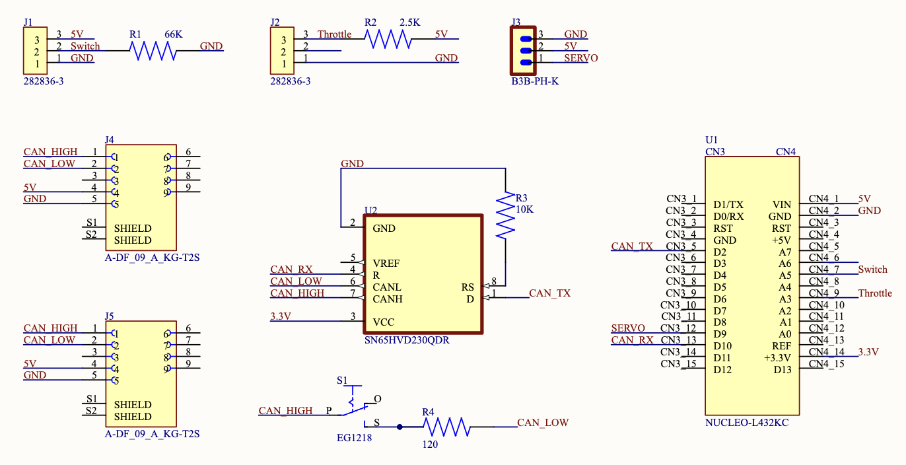
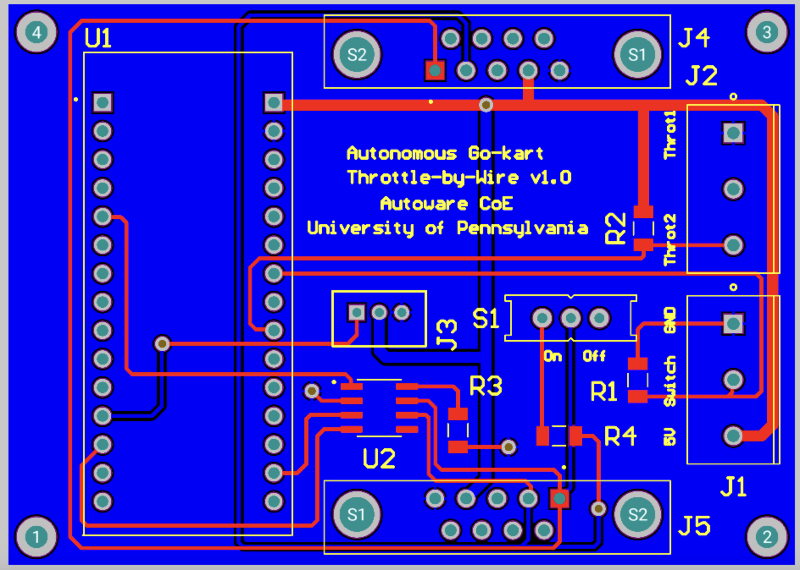

Throttle-by-Wire Subsystem
---------------------------

The TBW is a specially-designed PCB mounted on the side of the driver’s seat, controlling the go-kart’s main drive motor. The TBW’s Nucleo interfaces with the CAN bus to receive desired speed values and to transmit measured speeds. The speed measurement utilizes a hall effect wheel speed sensor positioned near the go-kart’s rear shaft. Speed modulation is facilitated through a closed-loop PID mechanism. The Nucleo emits a PWM signal of variable duty cycle, which is then converted to a 0-5V analog signal. This analog signal is channeled to the Alltrax SR48300 DC Motor Controller, governing speed control. Another noteworthy design element is the remote kill switch. This allows the operator to remotely halt power in emergencies. Realized through a remote relay, this switch can interrupt power delivery to the main motor, serving as an independent safety feature even in the event of a worst-case system malfunction.

      img1: Schematic of Throttle by Wire

      img2: PCB of Throttle by Wire

Code Structure Overview
~~~~~~~~~~~~~~~~~~~~

1. **Introduction**
   Embedded within an STM32 microcontroller, the software drives the throttle-by-wire subsystem of a vehicle. It processes throttle commands and motor directions from the CAN bus, computes vehicle speed, and returns this data on the CAN network. The system also generates a PWM signal for motor speed control, utilizing a plethora of hardware components including GPIOs, USART2 for serial communication, CAN1 for network communication, and multiple timers.

2. **Initialization**
   The code's preliminary segment initializes the system clock and vital hardware peripherals - USART2, CAN1, and timers like TIM1, TIM6, TIM7, and TIM16. These peripherals, once initialized, play a pivotal role in the system's functionality, overseeing communication and timing tasks.

3. **Key Variable and Structures**
   A plethora of structures and variables are instantiated to facilitate CAN communication (``CAN_TxHeaderTypeDef``, ``CAN_RxHeaderTypeDef``), UART communication (``huart2``), CAN network management (``hcan1``), and timer handling (``htim1``, ``htim6``, ``htim7``, and ``htim16``). Additionally, certain variables retain values pertaining to motor direction, throttle magnitude, speed sensor readings, and computed speeds.

4. **CAN Reception and Processing**
   The ``HAL_CAN_RxFifo0MsgPendingCallback`` function, acting as an interrupt handler, is invoked when a fresh CAN message arrives. Within this handler, the throttle magnitude and motor direction are derived from the incoming CAN data.

5. **Timer Callbacks and Operations**
   The ``HAL_TIM_PeriodElapsedCallback`` function is activated upon the lapse of a timer duration. Depending on the timer instance, operations like motor speed modulation via PWM, speed sensor reading capture, or speed computation and CAN transmission are performed.

6. **UART Write Function**
   Primarily for debugging, the ``_write`` function supplants the default write function, enabling UART2 data transmission.

7. **System Clock Configuration**
   The system clock configuration resides within the ``SystemClock_Config`` function, typically autogenerated by STM32CubeMX.

8. **CAN Initialization**
   The ``MX_CAN1_Init`` function orchestrates CAN bus setup, defining parameters such as DLC, Identifier types, Frame types, and more.
