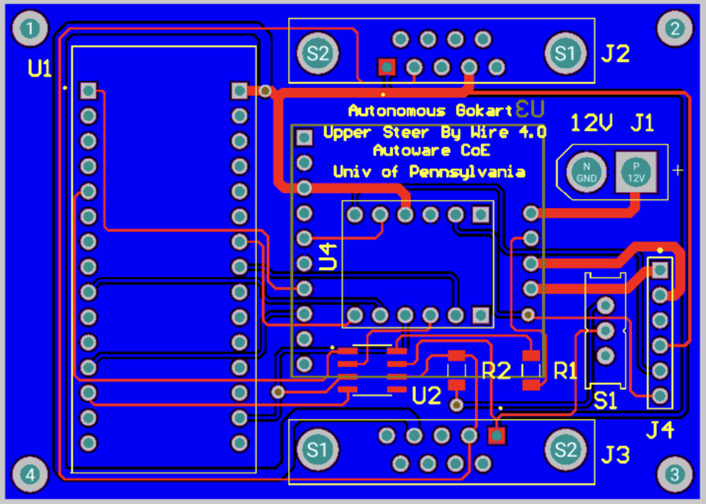

Upper Steer-by-Wire Electrical Subsystem
---------------------------

The original unmodified go-kart platform uses an alloy shaft to connect the steering wheel 
and the front wheel. Steering is made possible entirely through the driver’s torque input. 
In order to provide an autonomous mode, a motor must be added to actuate the steering. Several 
design ideas have been composed: one attempt was to mount the motor parallel to the steering shaft 
and use a belt or chain for motion transmission.

Upper Steer-by-Wire 
~~~~~~~~~~~~~~~~~~~~
The USbW is a unique PCB mounted near the steering column. This module controls the go-kart's steering mechanism. 
The USbW’s Nucleo receives the desired steering angle from the CAN bus and sends out the current steering position. 
Angle measurement is done using a rotary encoder fitted directly to the steering shaft. Steering control is 
implemented using a closed-loop PID control. The Nucleo outputs a PWM signal to the motor controller. An additional feature is the manual override, allowing the driver to take over steering control 
instantly. This feature uses a toggle switch and bypasses the electronic system, ensuring safety in the event of 
an electronic malfunction.

`Bill of Materials <https://docs.google.com/spreadsheets/d/1cxs_lTEWQj0czenRu5Ci73MoizaH6_svsTEhqSam2Ew/edit?usp=drive_link>`_

 

img1: schematic of upper-steer-by-wire

 

img2: PCB of upper-steer-by-wire

Code Structure Overview
~~~~~~~~~~~~~~~~~~~~

1. **Introduction**
   The software is tailored for STM32 microcontrollers, acting as the brain of an Upper Steer-by-Wire system. 
   It processes steering instructions received from the CAN bus, calculates the current steering angle, and 
   sends feedback via the CAN bus. It also outputs a PWM signal for steering adjustment. The design integrates 
   various hardware components, including GPIOs, USART2 for debugging, CAN1 for inter-device communication, 
   and several timers.

2. **Initialization**
   The first step in the code establishes the system clock and activates essential peripherals such as USART2, 
   CAN1, and timers - TIM2, TIM3, TIM8, and TIM17. These initialized modules are fundamental to the system’s 
   operation, managing data transmission and system timing.

3. **Key Variable and Structures**
   Various structures and variables support CAN communication (``CAN_TxHeaderTypeDef``, ``CAN_RxHeaderTypeDef``), 
   UART communication (``huart2``), CAN interface (``hcan1``), and timer modules (``htim2``, ``htim3``, ``htim8``, 
   and ``htim17``). Variables also store the steering angle, desired steering position, encoder readings, 
   and more.

4. **CAN Reception and Processing**
   The ``HAL_CAN_RxFifo0MsgPendingCallback`` function acts as an ISR (Interrupt Service Routine) that's 
   triggered whenever there’s a new message on the CAN bus. This handler extracts the desired steering angle 
   from the CAN data.

5. **Timer Callbacks and Operations**
   The ``HAL_TIM_PeriodElapsedCallback`` is activated when a timer expires. Depending on the timer instance, 
   tasks like adjusting the steering angle using PWM, reading encoder values, or sending current steering 
   position via CAN are executed.

6. **UART Write Function**
   To aid in debugging, the ``_write`` function is customized to send data via USART2, replacing the standard 
   output function.

7. **System Clock Configuration**
   The ``SystemClock_Config`` function, generally produced by STM32CubeMX, sets up the system clock.

8. **CAN Initialization**
   ``MX_CAN1_Init`` function sets up the CAN bus. This includes parameters such as DLC, Identifier type, Frame 
   type, and more.

