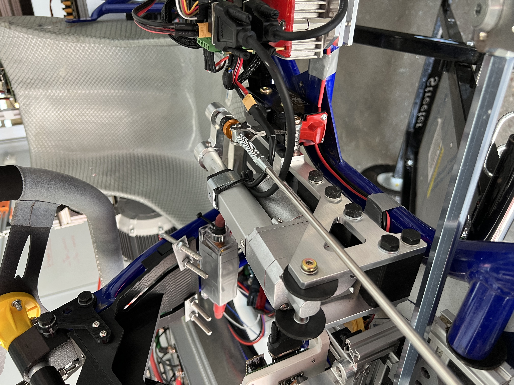
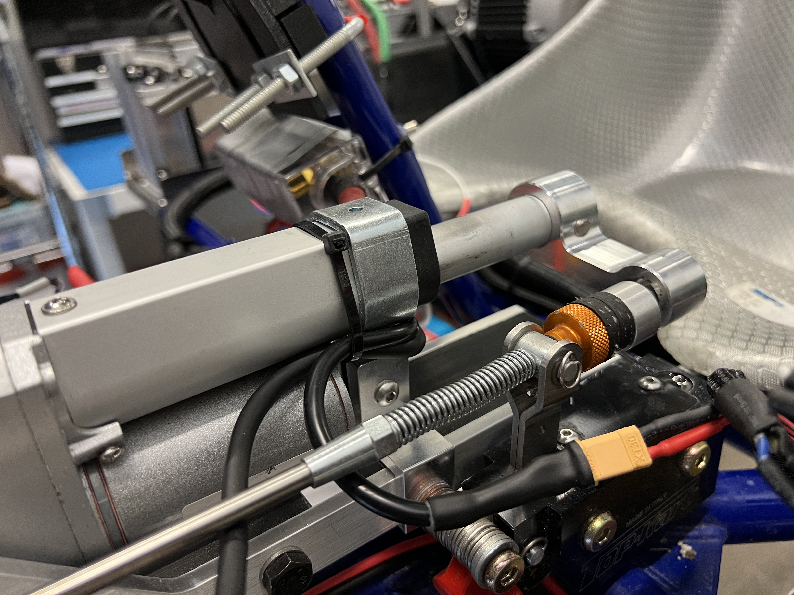
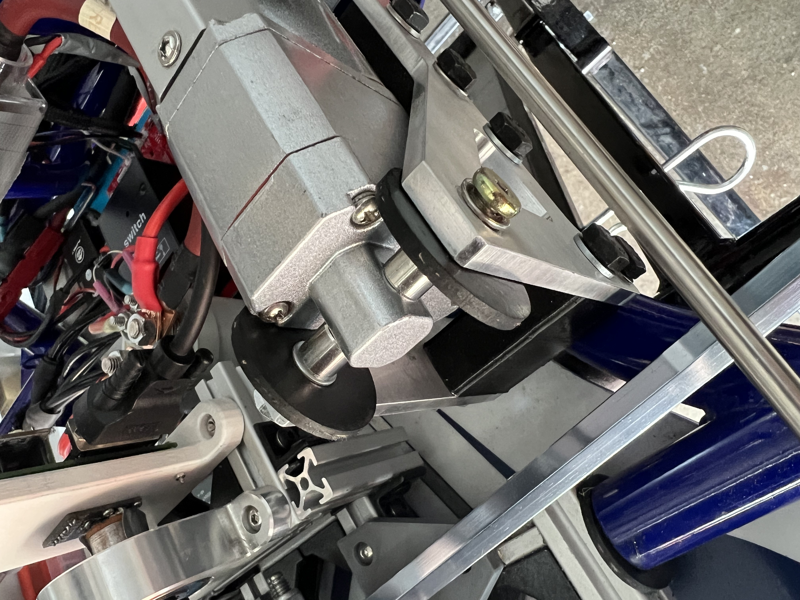
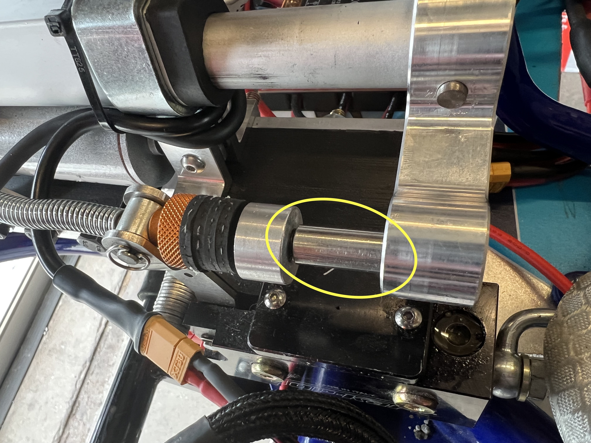
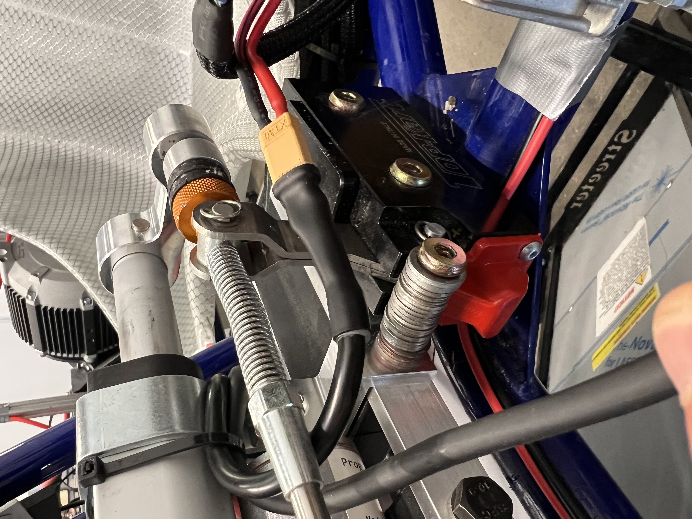
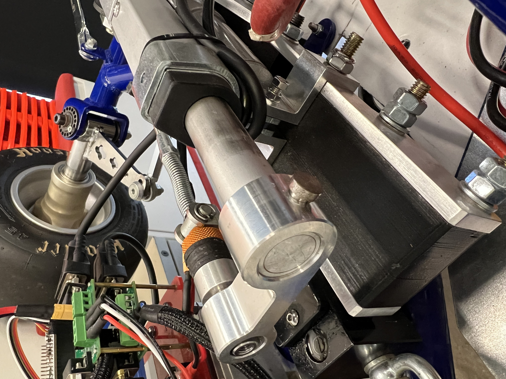

Brake By Wire (BBW) Assembly
==================================

Here is how the brake-by-wire system looks in CAD:

.. image:: ../imgs/Mechanical/bbw.png
    :width: 100%
    :align: center
    :alt: Brake By Wire Assembly

The brake-by-wire subsystem builds upon TopKart's original manual braking, by enabling the car to brake whenever necessary from autonomous mode. The higher level controller always sends some braking signal downstream to the BBW nucleo, which then runs a PID controller to quickly achieve the desired value. The system's sensor is a `M3041-000006-500PG Pressure Sensor: <https://www.digikey.com/en/products/detail/te-connectivity-measurement-specialties/M3041-000006-500PG/274609>`_, which closes the loop enabling PID feedback control to take place.

The system's actuator is a PA-14P Linear Electric Actuator DC Motor, `purchased from Amazon <https://www.amazon.com/PROGRESSIVE-AUTOMATIONS-Electric-Actuator-PA-14P-4-35/dp/B00Q74I8TI/>`_, which transmits motion via direct contact with the braking fluid reservoir lever, displacing it just as the left foot brake pedal would. The original TopKart braking mechanism then transfers (via the original braking fluid pipe) this hydraulic pressure to the rear axle, compressing its brake calipers and decelerating the car.

You can also view the exploded video view of the Assembly `here <https://drive.google.com/file/d/13RS9c54bLUqEbxeHZ715SWqoizlZVylu/view?usp=sharing>`_

Please open `this SolidWorks assembly <https://github.com/mlab-upenn/gokart-mechatronics/blob/main/Mechanical/BBW/BBW%20ASM.zip>`_ containing all necessary components for the BBW subsystem, to follow along with the instructions. Note that some parts were purchased off-the-shelf, some were designed in-house and sent out for professional machining (mostly via PCBWay), and some were designed in-house and 3D printed in-house. All purchases are documented with a purchase link, all custom machined parts have an engineering drawing, and all custom 3D printed parts have an STL file. Some drawings and STL files will be attached within the next few days, we thank you for your patience.

.. image:: ../imgs/Mechanical/BBW_CAD_Overview.png
    :width: 100%
    :align: center
    :alt: Brake By Wire Assembly Overview

Step 1: Locate the following four components: (1) “LA [Linear Actuator] steel frame,” 2x `custom machined <https://github.com/mlab-upenn/gokart-mechatronics/blob/main/Mechanical/BBW/Engineering%20drawings/LA%20steel%20frame%20Drawing.pdf>`_; (3) “back link,” `custom 3D printed <https://github.com/mlab-upenn/gokart-mechatronics/blob/main/Mechanical/BBW/STL/back%20link.STL>`_; and (4) “mid link,” `custom 3D printed <https://github.com/mlab-upenn/gokart-mechatronics/blob/main/Mechanical/BBW/STL/mid%20link.STL>`_. Assemble them as shown in the images below. Note that you will need five M8 x 70mm Hex Socket Head Machine Screws, `purchased from Amazon <https://www.amazon.com/METALLIXITY-Socket-Machine-Screws-M8x120mm/dp/B09YNLFBRG/>`_, and nuts, and 10 M8 washers. Note also that despite the name of the "LA steel frame," specific metal material need not be steel.

.. image:: ../imgs/Mechanical/BBW_CAD_Step_1.png
    :width: 100%
    :align: center
    :alt: Brake By Wire Assembly Step 1

Step 2: Separately, locate the following four components: (1) "PA-14P motor," `purchased from Amazon <https://www.amazon.com/PROGRESSIVE-AUTOMATIONS-Electric-Actuator-PA-14P-4-35/dp/B00Q74I8TI/>`_; (2) “LA top mount,” `purchased <https://www.progressiveautomations.com/products/brk-03>`_; (3) “LA side mount,” 2x, `custom machined <https://github.com/mlab-upenn/gokart-mechatronics/blob/main/Mechanical/BBW/Engineering%20drawings/LA%20side%20mount%20Drawing.pdf>`_. Assemble them as shown in the images below. Note that you will need a single M5 screw and nut (both included with "top mount" purchase), which will tighten around the three mounts in series, in the process tightening the top mount around the motor.

.. image:: ../imgs/Mechanical/BBW_CAD_Step_2.png
    :width: 100%
    :align: center
    :alt: Brake By Wire Assembly Step 2

Step 3: At this point, you are ready to connect the two sub-assemblies from previous steps. To do so, locate a long M6 screw, `purchased from Amazon <https://www.amazon.com/uxcell-Threaded-Pitch-Socket-Screws/dp/B012THHR1G/>`_, and nut, as well as some washers. In addition, locate two copies of the “M6 x 10mm round connector nut” part, `purchased from Amazon <https://www.amazon.com/MroMax-Stainless-Threaded-Coupling-Connector/dp/B07YXXVC6D/>`_, and screw one on either side of the motor connection terminal, as shown in the image below. We also used some `large rubber washers <https://www.harfington.com/products/p-1054895?variant=42152220492025>`_, the combination of which ensures a tight fit between motor and steel mount.

.. image:: ../imgs/Mechanical/BBW_CAD_Step_3.png
    :width: 100%
    :align: center
    :alt: Brake By Wire Assembly Step 3

Step 4: Now you are ready to attach the extensions to the TopKart brake fluid reservoir lever, which will let it mate cleanly with the motor. Two new components are necessary here: "Brake rod extender," included from TopKart or `custom machined <https://github.com/mlab-upenn/gokart-mechatronics/blob/main/Mechanical/BBW/Engineering%20drawings/Brake_rod_extender.pdf>`_, and "Brake rod locator," `purchased from Amazon <https://www.amazon.com/MroMax-Stainless-Threaded-Coupling-Connector/dp/B07YXY6RW4/>`_, as well as some more `rubber washers <https://www.harfington.com/products/p-1054895?variant=42152220492025>`_ as used in Step 3. The following 3 steps are shown in the pictures below: First collect as many washers as necessary to make up ~13mm, and place them around the protruding external threading. Second, place the Brake rod extender around the threading, until flush with the washers. Finally, screw the Brake rod locator around the threading, until flush with the extender.

.. image:: ../imgs/Mechanical/BBW_IRL_Step_4p1.jpeg
    :width: 100%
    :align: center
    :alt: Brake By Wire Assembly Step 4a
.. image:: ../imgs/Mechanical/BBW_IRL_Step_4p2.jpeg
    :width: 100%
    :align: center
    :alt: Brake By Wire Assembly Step 4b

Step 5: At this point, you are ready to connect the full BBW assembly with the TopKart braking reservoir. Doing so will require three M8 x 120mm hex socket head machine screws, `purchased from Amazon <https://www.amazon.com/METALLIXITY-Socket-Machine-Screws-M8x120mm/dp/B09YNLHP5Q/>`_, nuts, and washers, and will look as shown below. You will also need to locate the “front link” part, `3D printed <https://github.com/mlab-upenn/gokart-mechatronics/blob/main/Mechanical/BBW/STL/front%20link.STL>`_, as this will rest in between the two identical steel frames, just as before. Note that in addition to these three components (just like Step 1), the screws must also pass through the entire braking reservoir, as that is what connects the BBW assembly to the existing gokart. Note also that the front-most screw need not pass through the brake reservoir, so it has ~32mm of extra length; you can fill this with washers or nuts as we've done, or purchase a shorter screw, or cut off part of the screw.

.. image:: ../imgs/Mechanical/BBW_CAD_Step_5.png
    :width: 100%
    :align: center
    :alt: Brake By Wire Assembly Step 5

Step 6: Locate the “lever arm” part, `custom machined <https://github.com/mlab-upenn/gokart-mechatronics/blob/main/Mechanical/BBW/Engineering%20drawings/Lever%20arm%20Drawing.pdf>`_, and the "lever arm pin" part, 'custom machined <https://github.com/mlab-upenn/gokart-mechatronics/blob/main/Mechanical/BBW/Engineering%20drawings/Lever_arm_pin_drawing.pdf>`_. Attach the lever arm tightly to the protruding cylindrical end of the motor, using the lever arm pin, as shown in the image below. Note that the pin is slightly oversized, so you will likely need to use a hammer to get it in, and you might even need to sand it down a bit. Make sure that the lever arm's other side is roughly co-axial with and surrounding the brake rod locator from Step 4, to ensure smooth contact when BBW is actuated.

.. image:: ../imgs/Mechanical/BBW_CAD_Step_6.png
    :width: 100%
    :align: center
    :alt: Brake By Wire Assembly Step 6

Note that the BBW motor has its own driver, and the BBW system as a whole has its own nucleo, as mentioned in the Electrical (TODO insert link) documentation. The mounts for these two boards are included nearby, but in a different assembly, so those are documented in the "Miscellaneous" section of this documentation (TODO Insert link)

