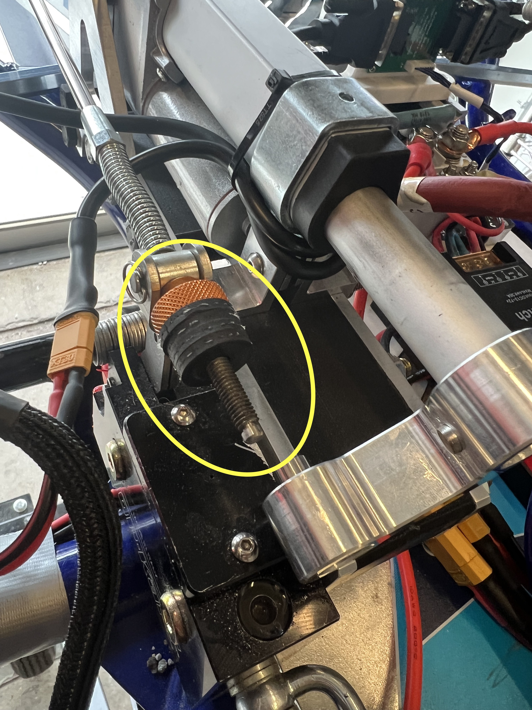
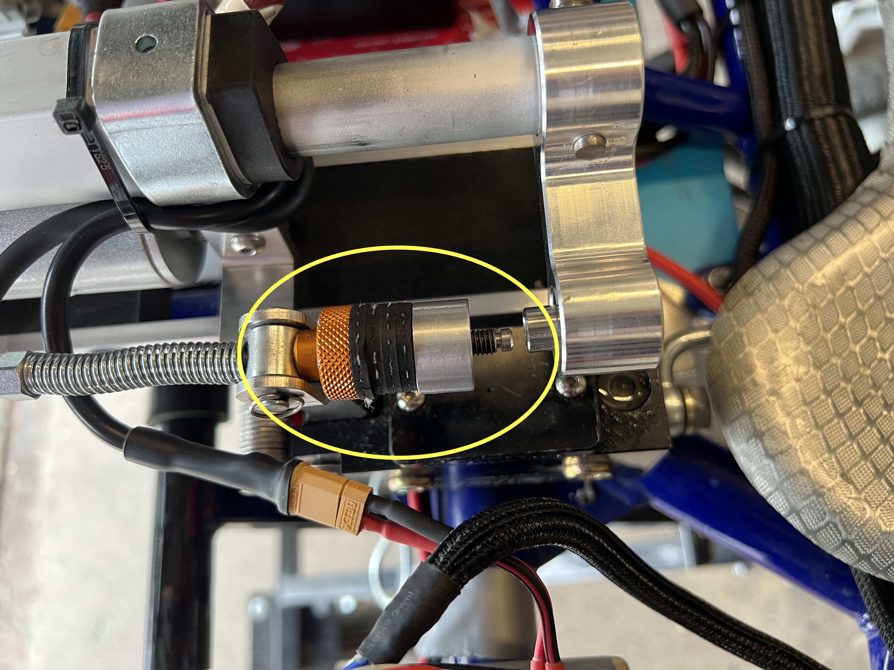

Brake By Wire (BBW) Assembly
==================================

Here is how the brake-by-wire system looks in CAD:

The brake-by-wire subsystem builds upon TopKart's original manual braking, by enabling the car to brake whenever necessary from autonomous mode. The higher level controller always sends some braking signal downstream to the BBW nucleo, which then runs a PID controller to quickly achieve the desired value. The system's sensor is a M3041-000006-500PG Pressure Sensor, which closes the loop enabling PID feedback control to take place.

`M3041-000006-500PG Pressure Sensor: <https://www.digikey.com/en/products/detail/te-connectivity-measurement-specialties/M3041-000006-500PG/274609>`_

The system's actuator is a Linear Electric Actuator DC Motor (clean up link, pasted below), which transmits motion via direct contact with the braking fluid reservoir lever, displacing it just as the left foot brake pedal would. The original TopKart braking mechanism then transfers (via the original braking fluid pipe) this hydraulic pressure to the rear axle, compressing its brake calipers and decelerating the car.

`Linear Electric Actuator DC Motor:
<https://www.amazon.com/PROGRESSIVE-AUTOMATIONS-Electric-Actuator-PA-14P-4-35/dp/B00Q74I8TI/ref=sr_1_2?keywords=PA-14P-4-35%2Blinear%2Bactuator&qid=1662603873&sr=8-2&ufe=app_do%3Aamzn1.fos.f5122f16-c3e8-4386-bf32-63e904010ad0&th=1>`_

You can also view the exploded video view of the Assembly `here <https://drive.google.com/file/d/13RS9c54bLUqEbxeHZ715SWqoizlZVylu/view?usp=sharing>`_

Please open this SolidWorks assembly to follow along with the `instructions <https://drive.google.com/file/d/1D94OQcvckCQK6pkSvAfoiwdd8uzogu2v/view?usp=drive_link>`_, containing all necessary components for the BBW subsystem. Note that some parts were purchased off-the-shelf, some were designed in-house and sent out for professional machining (mostly via PCBWay), and some were designed in-house and 3D printed in-house. All purchases are documented with a purchase link, all custom machined parts have an engineering drawing, and all custom 3D printed parts have an STL file. Some drawings and STL files will be attached within the next few days, we thank you for your patience.

Step 1: Locate the following four components: (1) “LA steel frame,” 2x custom machined, link coming shortly; (3) “back link,” custom 3D printed, link coming shortly; and (4) “mid link,” custom 3D prints, link coming shortly. Assemble them as shown in the images below. Note that you will need five `Hex Socket Head Machine Screws <https://www.amazon.com/METALLIXITY-Socket-Machine-Screws-M8x120mm/dp/B09YNLHP5Q/ref=sr_1_1_sspa?crid=1Y5MZ0CQAXP77&keywords=m8x120mm%2Bscrews&qid=1664676687&qu=eyJxc2MiOiIxLjg1IiwicXNhIjoiMC4wMCIsInFzcCI6IjAuMDAifQ%3D%3D&sprefix=m8x100mm%2Bscrews%2Caps%2C55&sr=8-1-spons&spLa=ZW5jcnlwdGVkUXVhbGlmaWVyPUExNVpFRkJKTThZSzgmZW5jcnlwdGVkSWQ9QTA1MjAwMThNVjY3U0tSSDA4UDEmZW5jcnlwdGVkQWRJZD1BMDQ3MzYwODJEM01HVksxRk5WWFMmd2lkZ2V0TmFtZT1zcF9hdGYmYWN0aW9uPWNsaWNrUmVkaXJlY3QmZG9Ob3RMb2dDbGljaz10cnVl&th=1>`_, nuts, and washers.

.. image:: ../imgs/Mechanical/BBW_IRL_Step_1.png
    :width: 100%
    :align: center
    :alt: Brake By Wire Assembly Step 1

Step 2: Separately, locate the following four components: (1) “PA-14P motor,” purchased; (2) “LA [Linear Actuator] top mount,” purchased, link coming shortly, (3) “LA side mount,” 2x, custom machined. Assemble them as shown in the images below. Note that you will need a single M5 screw and nut, which will tighten around the three mounts in series, in the process tightening the top mount around the motor.

.. image:: ../imgs/Mechanical/BBW_CAD_Step_2.png
    :width: 100%
    :align: center
    :alt: Brake By Wire Assembly Step 2

.. image:: ../imgs/Mechanical/BBW_IRL_Step_2.png
    :width: 100%
    :align: center
    :alt: Brake By Wire Assembly Step 2

Step 3: At this point, you are ready to connect the two sub-assemblies from previous steps. To do so, locate a long `M6 screw <https://www.amazon.com/uxcell-Threaded-Pitch-Socket-Screws/dp/B012THHR1G/ref=sr_1_5?crid=2S9ZIW0Q60Q2M&keywords=M6%2B*%2B70&qid=1668200774&sprefix=m6%2B70%2Caps%2C86&sr=8-5&th=1>`_ and nut, as well as some washers. In addition, locate two copies of the “sleeve 15mm” part, 3D printed or machined, and place one on either side of the motor connection terminal, as shown in the image below. We also used some large rubber washers, the combination of which ensures a tight fit between motor and steel mount.

.. image:: ../imgs/Mechanical/BBW_CAD_Step_3.png
    :width: 100%
    :align: center
    :alt: Brake By Wire Assembly Step 3

.. image:: ../imgs/Mechanical/BBW_IRL_Step_3.png
    :width: 100%
    :align: center
    :alt: Brake By Wire Assembly Step 3

Step 4: Now you are ready to attach the extensions to the TopKart brake fluid reservoir lever, which will let it mate cleanly with the motor. Two components are necessary here, a thicker (included from TopKart) and thinner (purchase link coming shortly) cylinder, as shown respectively in the images below. Further details on assembly are coming shortly

Step 5: At this point, you are ready to connect the full BBW assembly with the TopKart braking reservoir. Doing so will require three hex socket head machine screws (link coming shortly, longer than those from Step 1), nuts, and washers, and will look as shown below. You will also need to locate the “front link” part, 3D printed, STL coming soon, as this will rest in between the two identical steel frames, just as before. Note that in addition to these three components (just like Step 1), the screws must also pass through the entire braking reservoir, as that is what connects the BBW assembly to the existing gokart.

.. image:: ../imgs/Mechanical/BBW_IRL_Step_5.png
    :width: 100%
    :align: center
    :alt: Brake By Wire Assembly Step 5

Step 6: Locate the “lever arm” part, custom machined. Attach it tightly to the protruding cylindrical end of the motor, using a pin, as shown in the image below. Make sure that the other side is co-axial with the cylindrical extensions from Step 4, to ensure smooth contact when BBW is actuated.

.. image:: ../imgs/Mechanical/BBW_CAD_Step_6.png
    :width: 100%
    :align: center
    :alt: Brake By Wire Assembly Step 6

.. image:: ../imgs/Mechanical/BBW_IRL_Step_6.png
    :width: 100%
    :align: center
    :alt: Brake By Wire Assembly Step 6

Note that the BBW motor has its own driver, and the BBW system as a whole has its own nucleo, as mentioned in the Electrical (TODO insert link) documentation. The mounts for these two boards are included nearby, but in a different assembly, so those are documented in the "Miscellaneous" section of this documentation (TODO Insert link)

