Lower Steer By Wire (L-SBW) Assembly
==================================

This is the assembly of the Lower Steer By Wire (L-SBW) Assembly in CAD. The assembly is shown below:

This is the real life assembly of the L-SBW Assembly:

.. image:: ../imgs/Mechanical/SBW_1.jpg
    :width: 100%
    :align: center
    :alt: Lower Steer By Wire Assembly

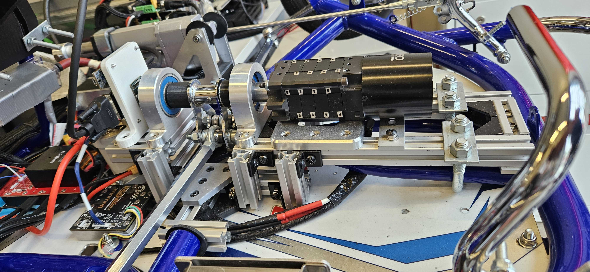

The Lower Steer-By-Wire subsystem is critical since it solely holds the power to redirect the car's motion left or right, in each of the three possible modes: manual, remote, and autonomous. It does so by rotating the rotor of a `BLCD motor <https://www.revrobotics.com/rev-21-2100>`_, which axially translates two tie rods, which simultaneously angles both front wheels left or right. In addition, the LSBW system gathers feedback on its rotation, enabling a PID controller to ensure convergence to the desired angle. The sensor chosen is the `AS5047P Magnetic Rotary Position Sensor <https://www.digikey.com/en/products/detail/ams-osram/AS5047P-TS-EK-AB/5452344>`_, which tracks angular motion of the rotor via a locally fixed magnet, and sends that information by wire directly to the LSBW nucleo. (TODO Insert links here!). In order for all these active components to assemble cleanly with each other, then with the existing GoKart chassis, various mounting components, including several t-slot frames, were designed. Instructions for full assembly of this system can be found below. Note that the entire system is perfectly symmetrical about the vertical front-facing plane of the car. For convenience, I will often simplify explanations by focusing on the right side (from the car's perspective) of the LSBW assembly, with the implication that the left side is a mirror image. I'll first describe assembly of the bottom half, which is composed primarily of t-slot frames and serves mostly as mechanical support for the top half's more active components:

Please open `this SolidWorks assembly <https://github.com/mlab-upenn/gokart-mechatronics/tree/main/Mechanical/SBW%20-%20lower/LSBW%20ASM>`_ containing all necessary components for the LSBW subsystem, to follow along with the instructions. You'll then need to open that folder's .SLDASM SolidWorks assembly file of the same name (including the most recent version number). Note that some parts were purchased off-the-shelf, some were designed in-house and sent out for professional machining (mostly via PCBWay), and some were designed in-house and 3D printed in-house. All purchases are documented with a purchase link, all custom machined parts have an engineering drawing, and all custom 3D printed parts have an STL file. Some drawings and STL files will be attached within the next few days, we thank you for your patience. Note that the broader gokart-mechatronics GitHub repo intentionally has some redundant/duplicated files, to avoid assembly bugs.

BOTTOM HALF ASSEMBLY

Step B1: First, build the base level of the mount. You'll have to cut four t-slots, two of length 165mm and two of length 56mm, and arrange them horizontally as shown in the image below. This subassembly allows for the active components above to connect to the provided blue TopKart chassis on either side; although this connection itself will take place in a later step.

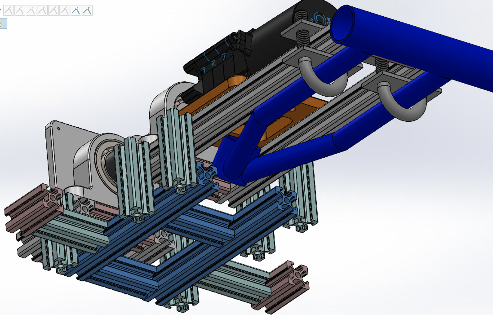

Step B2: Next, cut six t-slots of length 60mm, and attach them vertically around the outer perimeter of the base. Specific position dimensions can be found in the assembly linked above, although they're easily adjustable later and imprecision is fine.

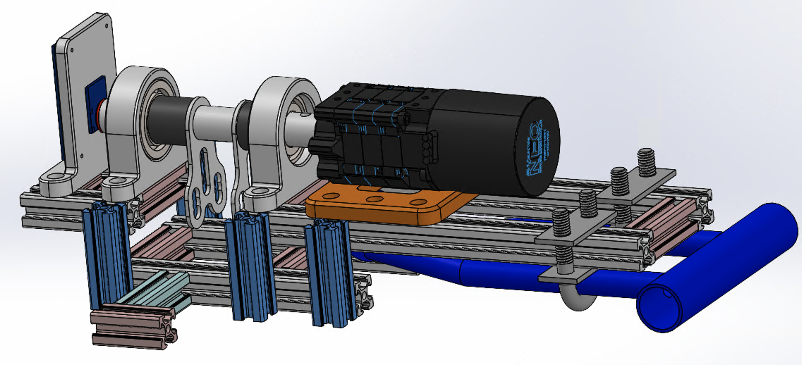

Step B3: Now cut four more t-slots, two of length 70mm and two of length 56mm, and assemble them as shown below. Note that the 70mm t-slots are on the GoKart's left and right (i.e. touching the vertical t-slots from Step 2), and the 55mm t-slots are in between them in the front and back. Note also that the backmost t-slot is not a critical component, so you can bypass this if assembly proves too difficult. Once you have this subassembly complete, attach it just inside of the vertical t-slots.

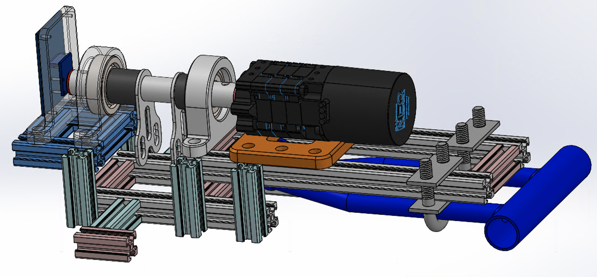

Step B4: Cut four more 4 t-slots, two of length 260mm and two of length 56mm, then arrange them in a rectangle as shown below. Then attach them to the four vertical t-slots near the front. For now, ignore the U-bolts shown in the CAD, unless this long rectangle starts to act as a bending cantilever, in which case you should skip to steps 5 and 6 (bottom half) and step 2 (full assembly) to attach the complete LSBW bottom half to the blue TopKart chassis frame.

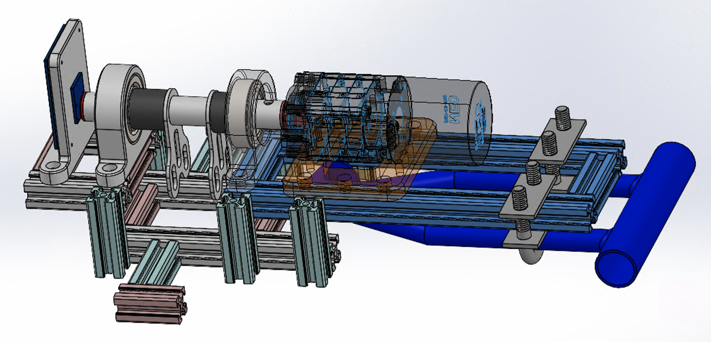

Step B5: Cut four more t-slots, each of length 60mm, and assemble them as two "L-pairs," as shown below. Then using four custom machined t-slot brackets, `two copies <https://github.com/mlab-upenn/gokart-mechatronics/blob/main/Mechanical/SBW%20-%20lower/Drawings/L_Pair_Bottom_Mount.pdf>`_ of "L-Pair Bottom Mount" and `two copies <https://github.com/mlab-upenn/gokart-mechatronics/blob/main/Mechanical/SBW%20-%20lower/Drawings/L_Pair_Top_Mount.pdf>`_ of "L-Pair Top Mount," attach both L pairs to the t-slot base from Step 1. You will also need five M5 nuts and bolts per bracket for t-slot mounting. Also, the left and right sides are perfectly symmetric.

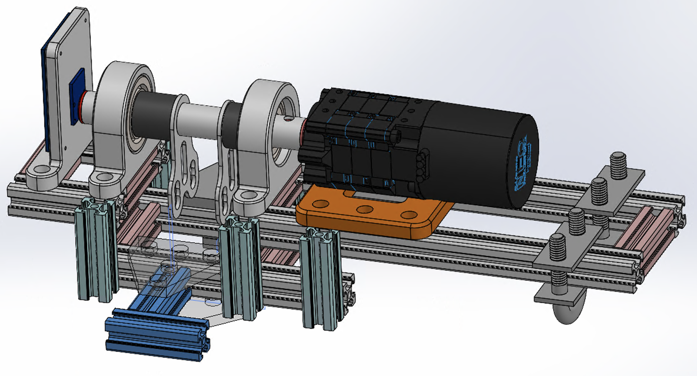
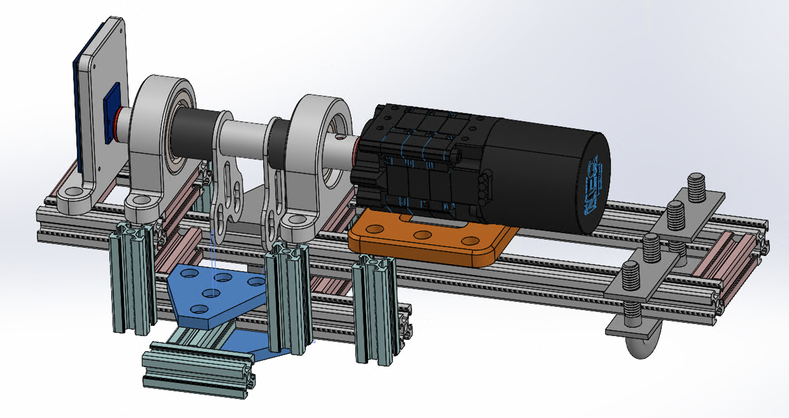
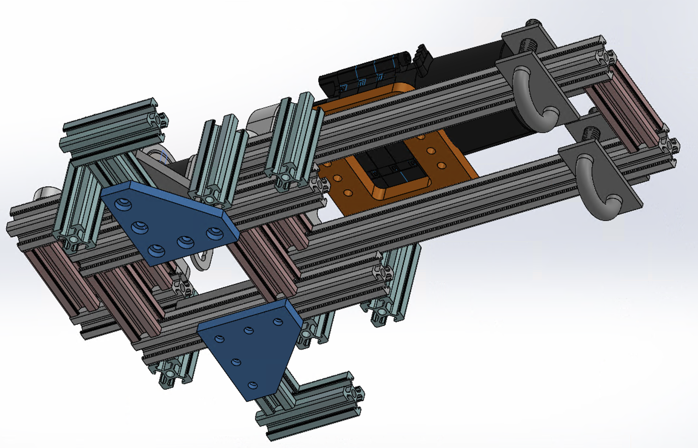

Step B6: Also, you should add an extra support for the BLCD near its front, namely a long t-slot connector screwed in with two M5 screws and nuts. You can either get this rectangular part custom machined using `our design <https://github.com/mlab-upenn/gokart-mechatronics/blob/main/Mechanical/SBW%20-%20lower/Drawings/LSBW_Motor_Front_Support.pdf>`_, or find some pre-existent part off-the-shelf, maybe similar to `these from Amazon <https://www.amazon.com/4040-Aluminum-Extrusion-Connector-Included/dp/B09Y1PC4FN/>`_ except for in shape; unfortunately we cannot right now find the right shape and dimensions anywhere online, but it might become available. Regardless, this part is purely a safety measure which isn't strictly necessary, so you can optionally skip it entirely.

TOP HALF ASSEMBLY

Step T1: First, you must modify the "TopKart Shaft," `drawing shown here <https://github.com/mlab-upenn/gokart-mechatronics/blob/main/Mechanical/SBW%20-%20lower/Drawings/TopKart_Shaft.pdf>`_ and image below consisting of 1 long hollow rod and 2 tie_rod_turners welded together. Although this part is initially provided and welded by TopKart, two more changes must be made manually: (1) Cut the shaft to length on either side of the tie_rod_turners, and (2): Drill a hole in the middle. Both changes are quantified in the drawing linked above.

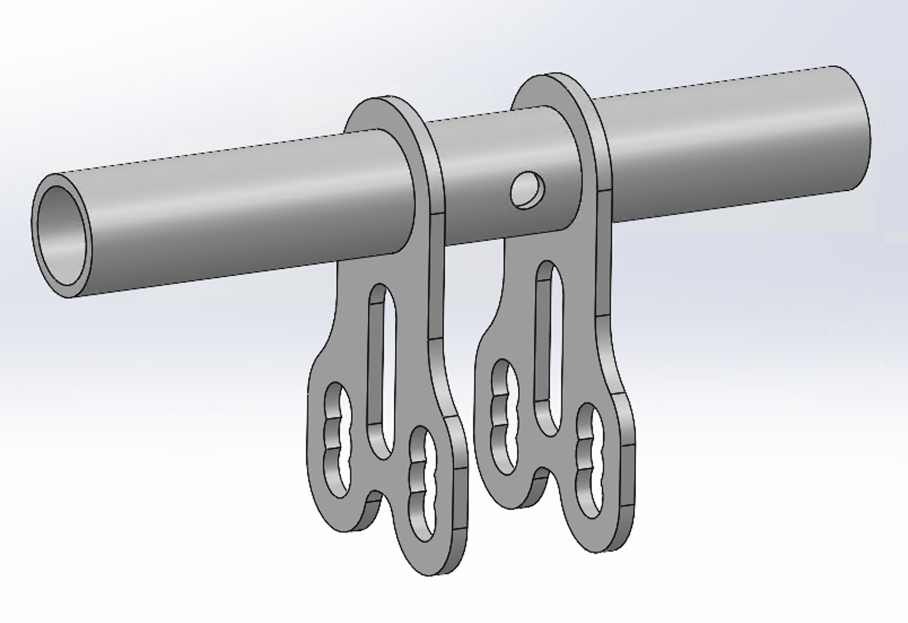

Step T2: Next, you must build the "Pinned Shaft" subassembly, shown below and included in the full LSBW CAD assembly linked above. This subassembly consists of three parts: "TopKart Shaft," from the previous step, "hexagonal shaft," `custom machined <https://github.com/mlab-upenn/gokart-mechatronics/blob/main/Mechanical/SBW%20-%20lower/Drawings/hexagonal%20shaft.pdf>`_, and "hexagonal shaft pin," `custom machined <https://github.com/mlab-upenn/gokart-mechatronics/blob/main/Mechanical/SBW%20-%20lower/Drawings/Hexagonal_shaft_pin.pdf>`_. You must simply insert the hexagonal shaft's cylindrical portion into the TopKart shaft's shorter end, until you see the pin holes align. This will likely require non-negligible force. Then, connect them together using the pin and a hammer. Note that the hexagonal shaft will transmit motion from motor to TopKart shaft (and indirectly, everything else), and is very long to ensure stability.

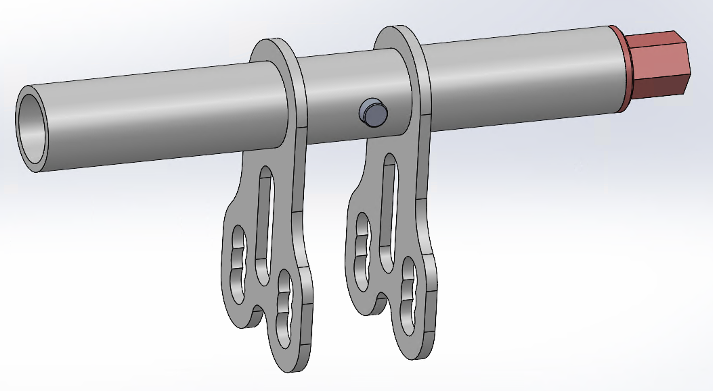

Step T3: Locate 2 `heim joints <https://shop.topkartusa.net/products/heim-joints>`_, two screws (link coming shortly) and several spacing features such as washers. Separately on both sides of the LSBW assembly, attach one heim join right in between, with the nut facing out. To do so, get it in position, surrounded by all necessary spacing features, then pass the screw in from one end, then tighten it from the other with a nut.

.. image:: ../imgs/Mechanical/Heim_connection.png
    :width: 100%
    :align: center
    :alt: Lower Steer By Wire Assembly Step T3

Step T4: Press fit the " `sleeve front <https://github.com/mlab-upenn/gokart-mechatronics/blob/main/Mechanical/SBW%20-%20lower/Drawings/sleeve%20front.pdf>`_ ," and " `sleeve back <https://github.com/mlab-upenn/gokart-mechatronics/blob/main/Mechanical/SBW%20-%20lower/Drawings/sleeve%20back.pdf>`_ ," both custom machined, from either end of the shaft, so each is flush with the tie_rod_turners. Note that we designed the sleeve front to include a 45° 2mm internal chamfer, to leave space for the tie_rod_turner's welding marks; depending on the quality of your particular parts, you might wish to remove or modify this feature, and/or create a similar one on sleeve back. Note also that our physical GoKart included these parts 3D printed out of black plastic, but we recommend you go one step further and use metal for enhanced strength under high loads.

Step T5: Attain four parts: two copies of "deep groove bearing," `purchased <https://www.amazon.com/6204-2RS-Sealed-Bearing-20x47x14-Lubricated/dp/B07BN3X9BY?ref_=ast_slp_dp>`_, and two copies of "bearing mount," `custom machined <https://github.com/mlab-upenn/gokart-mechatronics/blob/main/Mechanical/SBW%20-%20lower/Drawings/bearing%20mount.pdf>`_. Then press fit the bearings into the bearing mounts, separately.

Step T6: Press fit the bearing pockets around the welded shalf, until they're touching the metal sleeves. At the end of this step, your subassembly should look like the image attached below.

Step T7: From the AS5047P sensor kit, locate the magnet, and also attain the "magnet mount" part, `3D printed <https://github.com/mlab-upenn/gokart-mechatronics/blob/main/Mechanical/SBW%20-%20lower/STL/magnet%20mount.STL>`_. Insert the magnet into its mount using some tape, then insert its mount into the welded shalf via press fit. Note that this mount is 3D printed unlike all the metal parts of this LSBW subassembly; plastic is preferable to avoid electromagnetic interference with the sensor.

.. image:: ../imgs/Mechanical/LSBW_IRL_T7.jpeg
    :width: 100%
    :align: center
    :alt: Lower Steer By Wire Assembly Step T7

Step T8: Locate the `BLCD motor <https://www.revrobotics.com/rev-21-2100>`_, and attach it one piece at a time to the Pinned Shaft (namely, its hexagonal shaft). The CAD image below labels each part 1 (back) through 7 (front), in order of attachment. Part 1 is the Shaft Connector, Parts 2 through 5 are (multiplicative) gears, Part 6 is the front gear guard, and Part 7 houses the motor itself i.e. the magnetic components. Much of this assembly is very intuitive, and if necessary, can benefit from the assembly directions provided by the motor manufacturer. Note that the Rev Robotics link above for the motor only includes 3 gear cartridges in series, but you'll need to add a 4th too, namely `this additional 4:1 gear <https://www.revrobotics.com/rev-21-2102/>`_, in order to achieve the necessary force amplification.

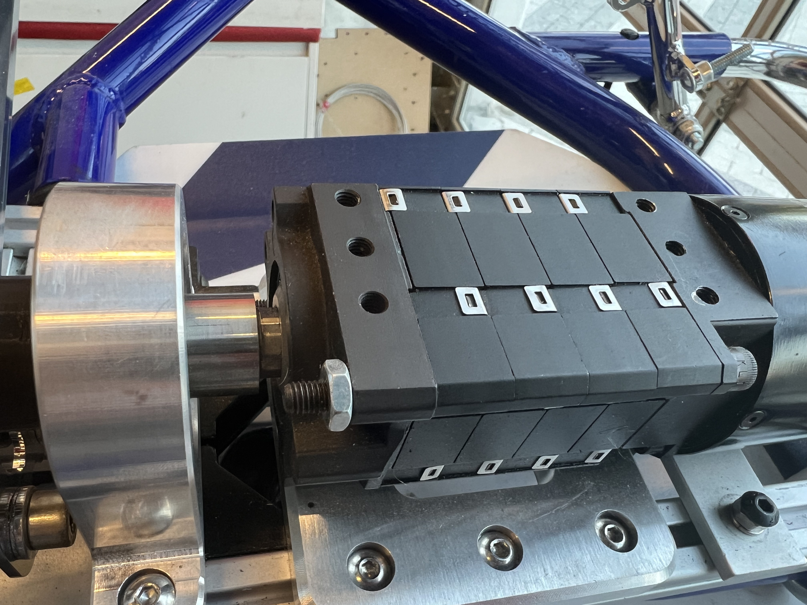
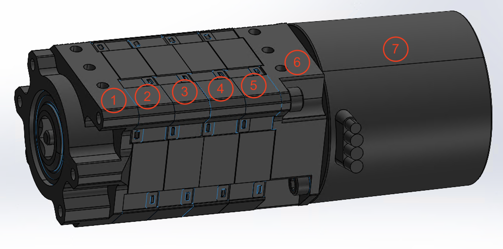

Step T9: Locate the "LSBW motor mount" custom machined part, `engineering drawing here <https://github.com/mlab-upenn/gokart-mechatronics/blob/main/Mechanical/SBW%20-%20lower/Drawings/LSBW%20motor%20mount.pdf>`_. Then using 3 screws (TODO figure out which screws) per side, connect it from underneath to the motor.

Step T10: Attain the "AS5047P mount," `3D printed <https://github.com/mlab-upenn/gokart-mechatronics/blob/main/Mechanical/SBW%20-%20lower/STL/AS5047P%20mount.STL>`_. Note that this part is 3D printed, unlike most other components of the LSBW subsystem, to avoid electromagnetic interference on the sensor. Also attain the AS5047P sensor board (provided with the sensor), and extract whatever (soldered) wires will connect this to the nucleo, passing them backward through the mount's rectangular pocket; then screw that sensor onto the outer (i.e. further from the base holes) side of the mount, using 4 small screws (TODO figure out what screws!). Then attain the LSBW PCB (including its nucleo MCU), and after completing the aforementioned connections, screw this onto the inner side of the mount, using 4 small screws (TODO Figure out screw type); you might need to leave a small gap for the nuts from the AS5047P mounting, this is fine. Note also that the part from this Step 10 is unconnected to those from Steps 1-9, which are themselves all connected.

.. image:: ../imgs/Mechanical/LSBW_IRL_T10a.jpeg
    :width: 100%
    :align: center
    :alt: Lower Steer By Wire Assembly Step T10
.. image:: ../imgs/Mechanical/LSBW_IRL_T10b.jpeg
    :width: 100%
    :align: center
    :alt: Lower Steer By Wire Assembly Step Step T10

FULL ASSEMBLY

Step F1: To attach the entire top half assembly to the entire bottom half assembly, simply locate twelve M5 screws, nuts, and washers, then screw in everything as shown below. Note that the AS5047P magnet and board must be between 0.5mm and 3mm apart.

Step F2: To attach the entire LSBW assembly to the GoKart chassis in the front, recreate the two connection shown in the first image below. The first two are circled near the front, and each contains one `U-bolt <https://www.mcmaster.com/3043T629/>`_ and one `U-bolt mount plate <https://www.mcmaster.com/8875T914/>`_, with two nuts for tightening. You should also insert a long t-slot connector, `the same as from Step B6 <https://github.com/mlab-upenn/gokart-mechatronics/blob/main/Mechanical/SBW%20-%20lower/Drawings/LSBW_Motor_Front_Support.pdf>`_, below the very front of the LSBW assembly, as shown in the 2nd image below, held in place by all the weight on top of it.

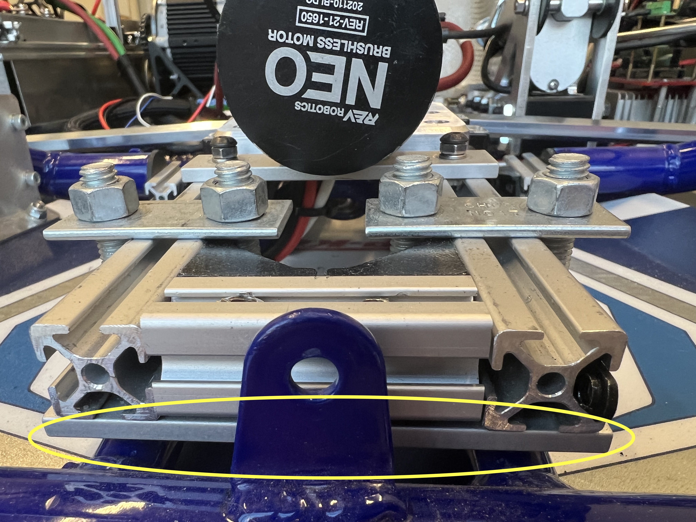

Step F3: To attach the entire LSBW assembly to the GoKart chassis in the back, recreate the connection circled in the image below (and its mirror image), involving press fitting the LSBW system into the chassis via these two t-slot L-pairs. We also used a large black rubber washer on either side, to deform and facilitate tight connection. Assembly might require some wiggling around, and/or temporary removal of some t-slot connections.

.. image:: ../imgs/Mechanical/LSBW_IRL_F3.jpeg
    :width: 100%
    :align: center
    :alt: Lower Steer By Wire Assembly Step F3

Step F4: Connect the two `tie rods <https://sharkshifter.com/products/tie-rods-alum-hex-8mm-go-kart?variant=37384922628262>`_ to the heim joins on either side, by simply screwing (TODO Figure out which screw) them in. At the end, screwing in to the wheel connector should notably occur on the outermost of the two holes, as shown below. TODO insert some more tips on calibrating the tie rod length, based on what George taught me.

