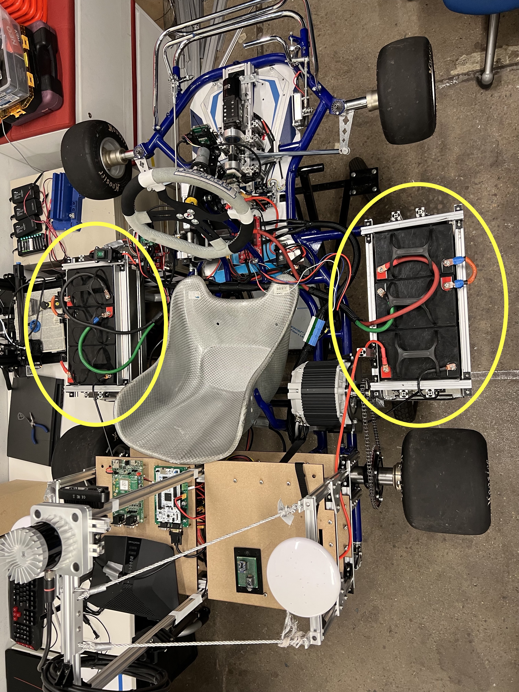
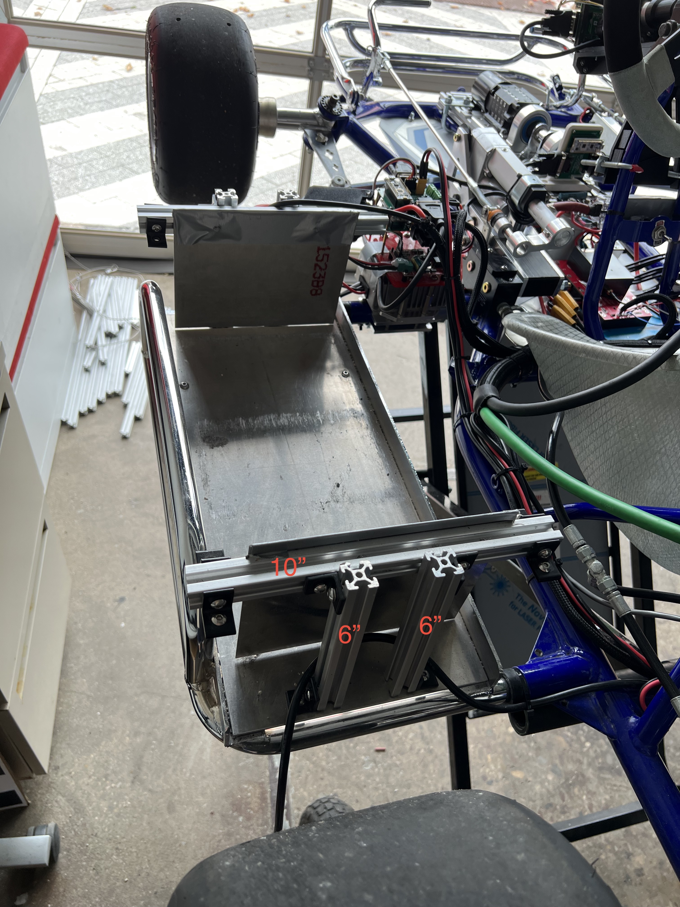
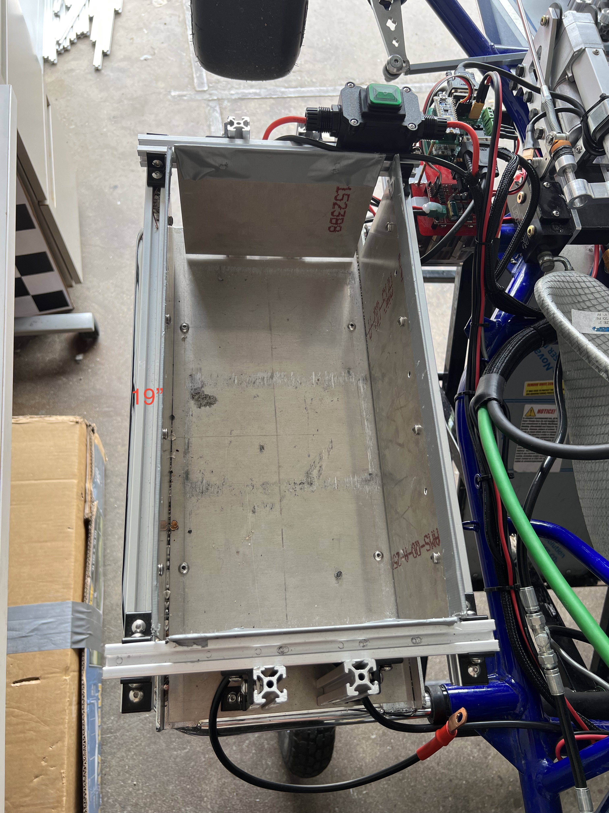
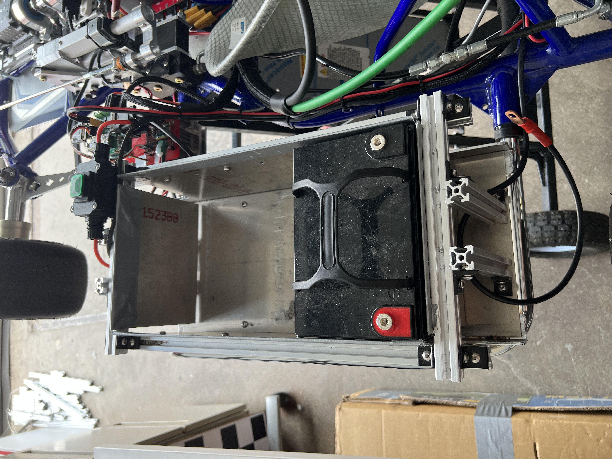
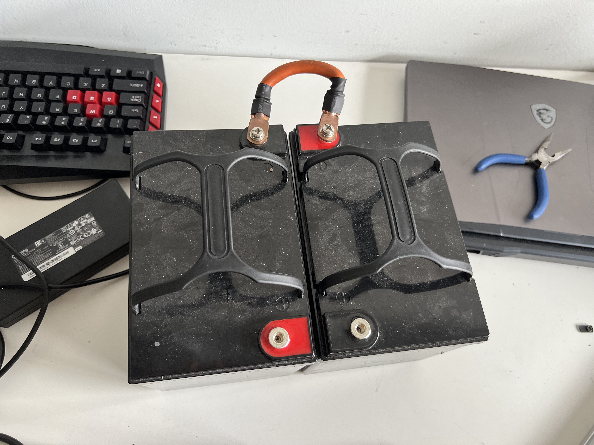
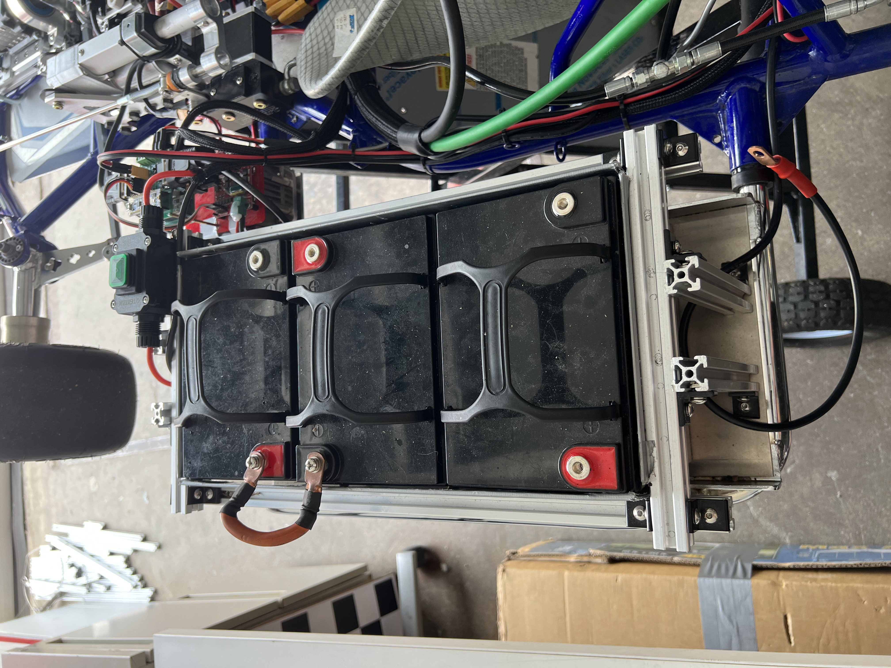
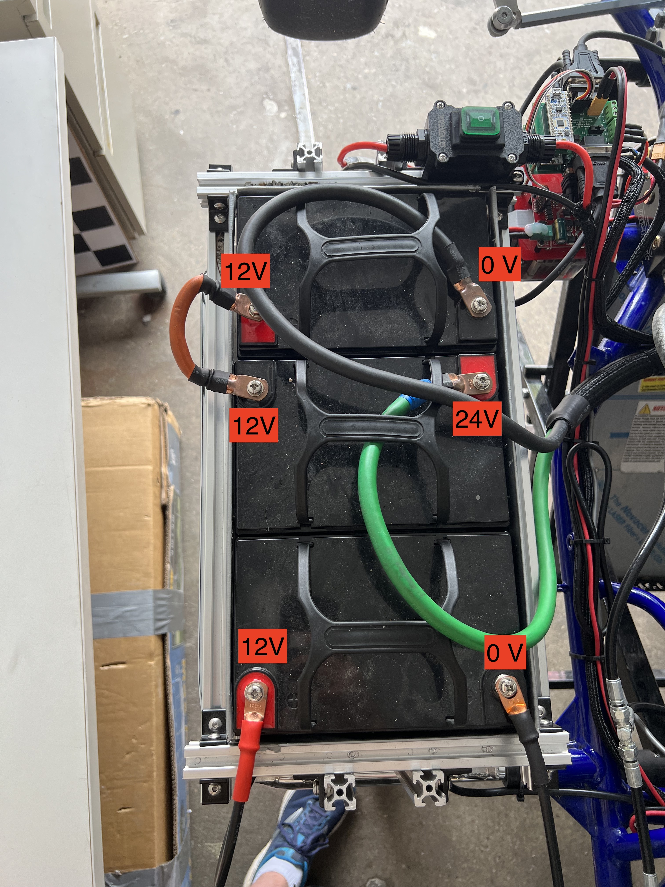

==================================
Battery Assembly
==================================

Safety disclaimer:  
=================

.. warning::

   Especially when connected in series, these batteries create very high voltages. When connected accidentally in certain configurations (such as through a human body, via your arms), you can close the loop and short the circuit, withstanding 48V. It is highly recommended that you exercise caution, namely by (1) wearing electrically-insulating gloves, (2) touching only one part at a time, and (3) avoiding wire clutter and/or damage. In addition, (5) you should always connect the 48V in-series batteries from high to low voltage, so that when you finally close the circuit's loop and connect it to ground, you're only touching 12V (rather than the max 48V). In contract, (6) disconnecting the batteries should follow the reverse ordering i.e. disconnect from low to high voltage, so that you're only touching 12V at the beginning while the circuit is still closed with current flowing.

The go-kart is powered by six (nominally) 12V LiPo batteries. Specifically, 4 batteries are arranged in series to supply 48V powering all the motors, and 2 batteries are connected in series powering everything else; for more on this, see the Electrical section (TODO Insert Link) We chose to use LiPo batteries since they are lighter, and have higher capacity than lead acid batteries as suggested by TopKart.

Please find all CAD in the /CAD/Battery_Box folder. Namely you will find the SolidWorks part file (.SLDPRT) as well as engineering drawings (.SLDDRW and .PD) for all four unique components (described below). These components started as raw rectangular Aluminum sheet metal stock (1mm thick), then in a university machine shop, we cut the sheets to size and manually drilled the holes. Note that for repeated parts (namely the two vertical sheets, which are 4x each), it can save you time to drill through all 4 sheets at once. In addition, t-slot frames are needed, and must be cut to length (imprecise tolerances are okay here). Recall our general tips for working with t-slots (TODO Insert link here) 

LEFT SIDE: BATTERY BOX
---------------

Step 1: Locate the "floor sheet left" sheet metal part. Oriented flat, attach it to the corresponding chassis component on the left side of the gokart, using four standard M5 nuts and screws.

Step 2: Cut four t-slots to 6" each, and attach them vertically to the floor sheet left, as shown in the image below. Only two t-slots are visible, but the other two follow trivially by symmetry.

Step 3: Cut two t-slots to 10" each, and attach them horizontally to the t-slots from Step 2, as shown in the image below. Note that each t-slot should be roughly centered, but this need not be perfect, and can be easily tuned later as necessary.

Step 4: Locate two "vertical sheet front and back" sheet metal parts, and screw them in to the t-slots from Step 3, as shown in the image below. You should then apply a layer of duct tape over the top of the sheet, to ensure it doesn't create electrical interference later on. At this point, your assembly should look exactly like the image below.

Step 5: Cut two t-slots to 19" each, and attach them horizontally to the t-slots from Step 3, as shown in the image below.

Step 6: Locate two "vertical sheet sides" sheet metal parts, and screw them in to the t-slots from Step 5, as shown in the image below. You should then apply a layer of duct tape, just like before. At this point, your assembly should look exactly like the image below.

LEFT SIDE: LIPO BATTERIES
----------------

Word of advice:  
=================

.. warning::
Before assembling the six batteries themselves, make sure its sensible given your immediate goals. The batteries total more than 60lb, which is over 1/3 of the gokart's total weight when fully assembled. So if you will need to physically pick up the car, doing so without the batteries will make your job easier (and require only 2 people instead of 3). Also, once you connect the batteries in series, the resulting 48V potential difference creates a safety hazard, which you might want to avoid whenever you're working without running tests.

Step 1: Locate one LiPo battery, and using its rubber handle, place it with the red terminal in the very back left corner, as shown in the image below.

Step 2: Locate two more batteries, and while still offboard, connect them as shown in the image below. Simply screw that battery terminal's screw back in, over the corresponding wire's circular terminal, ideally with a washer in between. You can keep this very short connection forever moving forward, besides while charging individual batteries, which saves one step during all subsequent battery installation/removal processes.

Step 3: Place these two batteries (while still connected) into the battery box, as shown in the image below. Make sure the available terminals are on the right (inner) side, for smoother in-series connection with the right side batteries.

Step 4: For the top two batteries, connect each one's remaining terminal to its corresponding wire, as laid out in the Electric section of this documentation (TODO Insert link here). Note that the voltages shown below will be generated as a result, so be very careful. Namely, remember to connect from high to low voltage, meaning the left side Step 4 should actually occur after the right side step 4. Within the left side Step 4, the 24V (middle battery, red terminal) connection should come first, then the 0 V ground connection (top battery, black terminal). Also, note that in order to constrain these wires and prevent loose or cluttered regions, we passed the wires through the battery handles.

Step 5: Connect the two terminals from the bottom battery, to their corresponding wires.

RIGHT SIDE: BATTERY BOX
----------------

Step 1: Locate the "floor sheet right" sheet metal part. Note that this is different from the floor sheet left part, specifically in its hole locations. Attach it to the corresponding chassis component, on the right side of the gokart.

Steps 2-6: Copy Steps 2-6 from the "LEFT SIDE: BATTERY BOX" section above. Note that all vertical sheets are identical to those from the left side battery box. Note also that the horizontal t-slots, specifically at the subassembly's back left corner, might be within 1cm of the Throttle By Wire assembly (namely the chain). This is okay, but you might want to do some stress testing to ensure that interference does not occur even when the motor is running. You might need to slide the battery box or the TBW assembly over to avoid interference.

Step 7 (optional): Cut another t-slot, to ~7", and attach it vertically somewhere near the back left corner. As shown in the image below, you can route the back-most battery's positive (red) connection straight up through this t-slots's pocket, to ensure that it stays above and thus clears the entire throttle by wire assembly, minimizing the likelihood of electromegnetic interference (EMI) as this wire travels to the rear shelf subassembly.

RIGHT SIDE: LIPO BATTERIES
-----------------

Steps 1-5: Copy Steps 1-5 from the "LEFT SIDE: LIPO BATTERIES" section. Remember that Step 4 for the right side should occur before Step 4 for the left side, since we connect batteries in order of highest to lowest voltage. For the right side batteries, this means connect the top (red) first, then the middle (black). Also remember for Step 5 that you should route the back battery's red wire up through the vertical t-slot, to avoid interference with the Throttle By Wire system.
