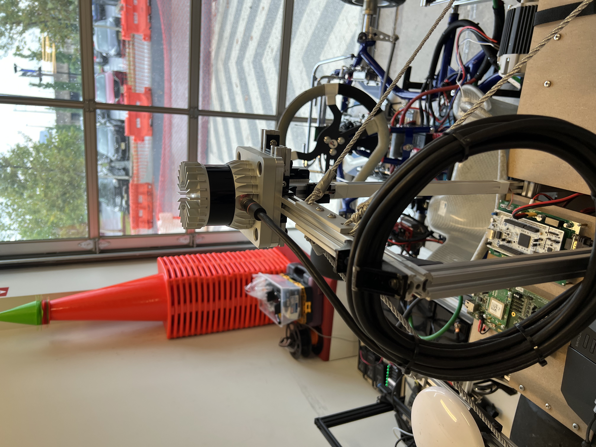

==================================
Rear Shelf Assembly
==================================

The rear shelf is critical for housing several of the system's various electrical components, as well as mounting some sensors (namely LiDAR, camera, and GNSS) high enough to obtain useful data. Each of these components is discussed elsewhere in this documentation (link here), so this section will discuss solely the mechanical processes for mounting everything securely. Please open `the full CAD assembly
<https://drive.google.com/drive/folders/1LDYO9l7htm_2q24RGqo3cVYqLVSxcw3b?usp=sharing>`_ and follow the step-by-step process as follows:

.. image:: ../imgs/Mechanical/RSD_CAD_full
   :width: 100%
   :align: center

Step 1: Cut six t-slots to length, approximately 210mm (2x) nad 146mm (4x). Then, mount them vertically as shown below in the CAD diagram. Note that the left and right components are symmetrical, so I'll discuss only the right side for simplicity.

.. image:: ../imgs/Mechanical/RSD_CAD_1
   :width: 100%
   :align: center

Step 1a: For the backmost t-slot, this connects in two ways, as shown in the images below. First, an M5 screw goes through a circular hole in the back; note that the mating nut inside the t-slot pocket will be hard to position due to its downward gravity, so you might benefit from holding it upright with some small tool, such as an Allan wrench inserted in the larger hole underneath. Second, a long M6 screw goes through the circular hole on the side, attaching to nuts on the opposite side; note that we used some large black rubber washers (one is circled in red) to ensure a tight fit here.

Step 1b: For the middle and frontmost t-slot, these connect in two ways as well, as shown in the images below. First, it rests on a hexagonal nut (and washer) which was already there to hold the bronze axle bearing mount in place. Make sure there is contact with the nut or washer, otherwise the t-slot might eventually become lose and slip in either direction. Second, a long M5 screw in attached from the other side of this bearing mount.

Step 2: Cut two t-slots to ~420mm, and attach each horizontally to the three t-slots from Step 1, using the four connectors circled in yellow below. Use a leveling tool to make sure this is perfectly horizontal, to ensure stability of the components that will subsequently rest on top; you might need to insert some washers in between the Step 1 and Step 2 t-slots, to adjust the height and ensure it is level.

.. image:: ../imgs/Mechanical/RSD_CAD_2
   :width: 100%
   :align: center

Step 3: Cut two t-slots to 656mm, and attach as shown by some combination of t-slot connectors

.. image:: ../imgs/Mechanical/RSD_CAD_3
   :width: 100%
   :align: center

Word of advice:  
=================

.. warning::

   You might wish to skip to Steps 13a and 13b now, namely attaching the lower level MDF sheets. That might get harder once the upper level frame is installed.

Step 4: Cut four t-slots to 140mm, and attach them vertically in all four corners, two of which are shown below.

Step 5: Cut two t-slots to 696mm, and attach horizontally on top of the t-slots from Step 4. 

.. image:: ../imgs/Mechanical/RSD_CAD_5
   :width: 100%
   :align: center

Step 6: Cuts four t-slots to 140mm, and cut two t-slots to 284mm. These will compose the left and right "GNSS tower" as we will call it moving forward. Assemble them as shown in the image below.

.. image:: ../imgs/Mechanical/RSD_CAD_6
   :width: 100%
   :align: center

Word of advice:  
=================

.. warning::

   You might wish to skip to Steps 13c and 13d now, namely attaching the upper level MDF sheets. That might get harder once the LiDAR tower is installed.

Step 7: Cut two t-slots to 610mm, and attach them vertically as shown below. Note that they connect flat on top of the t-slots from Step 3, as well as adjacent to the t-slots from Step 5; this second connection provided extra stability. Note that a height of 610mm worked for us given our requirements from the LiDAR and camera on top, but different applications might call for different heights.

.. image:: ../imgs/Mechanical/RSD_CAD_7
   :width: 100%
   :align: center

Step 8: Cut two t-slots to 304mm and 160mm (respectively), and assemble them horizontally in the T-shaped configuration shown below, on top of the tall t-slots from Step 7. This completes our tall "LiDAR tower," besides the LiDAR itself and its connecting mount, described below. 

.. image:: ../imgs/Mechanical/RSD_CAD_8
   :width: 100%
   :align: center

Step 9: Cut four sections of silver silk string, ~30" each. Use them to connect the top central t-slot section to the four corners of the GNSS t-slot level; doing so stabilizes the LiDAR from horizontal vibrations, without adding unnecessary weight or clutter. Achieving this connection will require you to first screw in some connectors, namely L-links at the four GNSS level corners, and planar quad connectors on either side of the top-most t-slot; this is all shown in the image below. Tying the string itself should be pretty straight forward, given the extra length allowance in your 30" cut. Tightening the string can be tricky, but one trick we discovered is to displace the LiDAR tower left or right to expose any loose sections of string, to be tightened. Note that the string has a relatively low Young's modulus i.e. it can stretch pretty easily, so you'll probably need to tighten it quite a bit to surpass the threshold of easy deformation.

.. image:: ../imgs/Mechanical/RSD_IRL_9
   :width: 100%
   :align: center

Step 10: Attach the Ouster LiDAR and its driver (link coming shortly)

.. image:: ../imgs/Mechanical/RSD_CAD_10
   :width: 100%
   :align: center
.. image:: ../imgs/Mechanical/RSD_IRL_10p1
   :width: 100%
   :align: center

Step 10a: Cut and assemble two more t-slots, to the lengths and orientations laid out in the CAD. You may wish to insert the M5 nuts for Step 9b as you do this, since they will be harder to insert later. 

Step 10b: Using M5 screw, nuts, and washers, screw in the "Ouster Mount" part (custom machined, link coming shortly) in the 12 locations as indicated in the image above.

Step 10c: Screw in the Ouster LiDAR itself, in the four holes around the corners of the Ouster Mount.

Step 10d: Next you will install the Ouster LiDAR. For this, you will need two copies of "Ouster Driver Mount," (3D printed, STL coming soon) which is very similar to a t-slot L-link. These connect onto the back of the LiDAR tower as shown in the images below. Note that the cable which connects this LiDAR driver to the LiDAR itself is rather long, and has several extra loops of cable. As shown in the images above, these loops are stabilized by two L-links, in front and behind.

Step 11: Next, you're ready to attach the left and right GNSS antennas, one per GNSS tower. Note that these two antennas must be at least ~30cm apart, a constraint which this configuration achieves by a large margin. In order to mount the two antennas, you'll need to attain two copies of the "GNSS_mount_V2," a custom 3D printed part (STL coming soon). First screw each antenna into its respective mount using the large provided screw, then screw each mount into the top of its respective GNSS tower using four M5 screws.

Step 12: Now, you will mount the remote controller receiver, as described in the MCU electrical section of this documentation (TODO attach link). To do so, attain the "RC Receiver Mount" custom 3D printed part (STL coming shortly), and simply screw it right below the LiDAR subassembly, using two M5 screws and nuts. Note that this location was arbitrary, and many alternatives could work instead. Next, simply place the receiver itself in the mount, with its wires routed out the bottom through the t-slots pocket, all the way down to the main nucleo

.. image:: ../imgs/Mechanical/ RSD_IRL_12.jpeg
   :width: 100%
   :align: center

Step 13: Finally, you're ready to attach the MDF sheets, onto which will be mounted several key electronic components. It's up to you whether you wish to attach these components to their respective MDF sheets before or after assembling into the car, since the convenience depends on what else you have already installed and wired together. For this section, you will need to laser cut four sheets of MDF (DXF files coming soon), namely "Bottom Plate Left Side V5," "Bottom Plate Right Side V5," "Top Plate Left Side V5," and "Top Plate Right Side V5," each within the "MDF Sheets" folder of the main Rear Shelf Assembly. These sheets have various differences (in hole quantity and location) depending on which components mount on. But one similarity is how they mount onto the t-slots beneath, namely through 9 holes each: 3 in the front, 3 in the back, and 3 on the side, each accepting an M5 screw.

.. image:: ../imgs/Mechanical/RSD_CAD_full
   :width: 100%
   :align: center

Step 13a: Bottom left sheet
------

We mounted the central PDU and Display driver onto this sheet. The PDU simply screwed right in (nuts underneath), with some black rubber washers providing sufficient elevation for solder and whatnot underneath. Note that the gap between lower and upper MDF sheets is about 6", which we felt would comfortably let engineers reach in to alter the PDU wiring, without adding too much unnecessary height. The Display driver also screwed in, with some wire terminals underneath to collect the necessary reading. And the Display itself was glued onto the t-slot right above, for visibility as well as wiring convenience.

Step 13b: Bottom right sheet
------

We mounted the three transformers (12V back right, 24V front right, 19V front left) here, using two screws/nuts each, and the 24V circuit switch (back left) using 4 screws/nuts. Turning this switch on (to the green setting) closed the 24V circuit. 

.. image:: ../imgs/Mechanical/RSD_IRL_12b.jpeg
   :width: 100%
   :align: center

Step 13c: Top left sheet
------

We mounted the main nucleo (front right) and the GNSS (front left) here. Both are elevated by some standoffs, giving space underneath for some solder and also some wires. We also mounted the router, simply using Velcro.

Step 13d: Top right sheet
------

This sheet accepts the laptop, whenever needed for sensor integration and higher level computations in autonomous mode. Although the laptop does not screw in anywhere, the strap can be used to secure it even while the car is moving. Note that by placing the laptop on the top shelf, it has enough space to open for usage. However, you can also close the laptop and strap it that way, just be sure to turn off auto-sleep. The strap can either run forward to backward, or run side to side using the MDF sheet's rectagular pocket.

