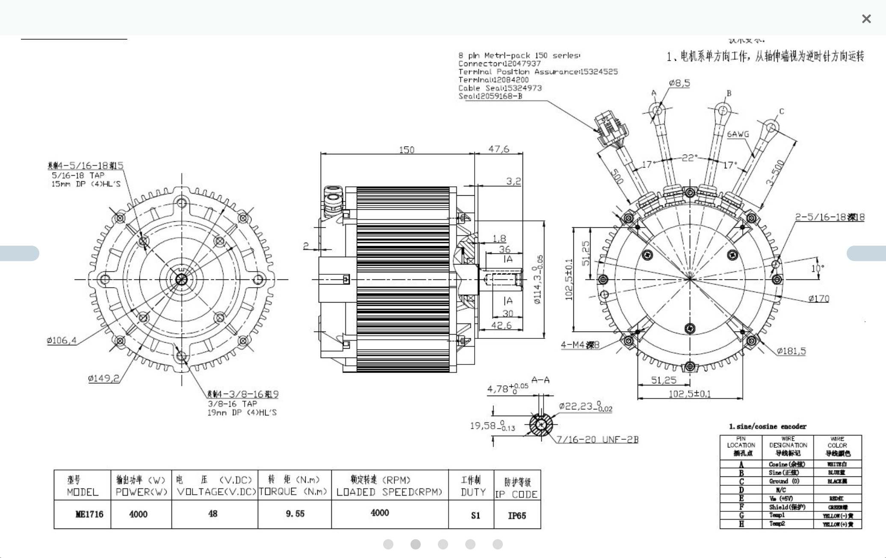
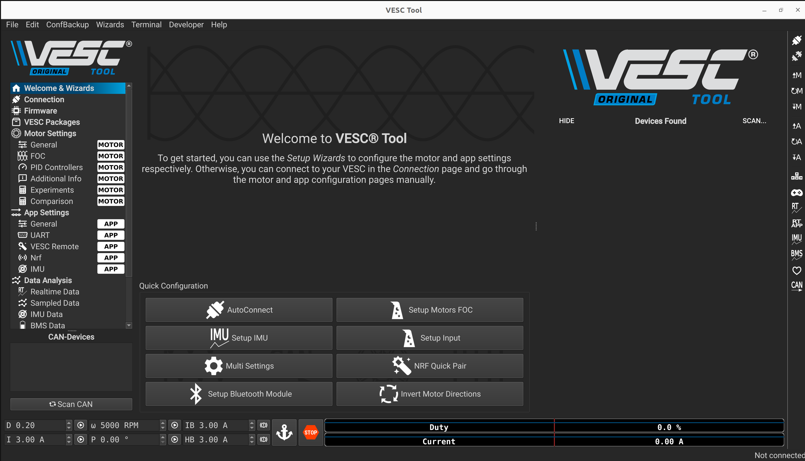
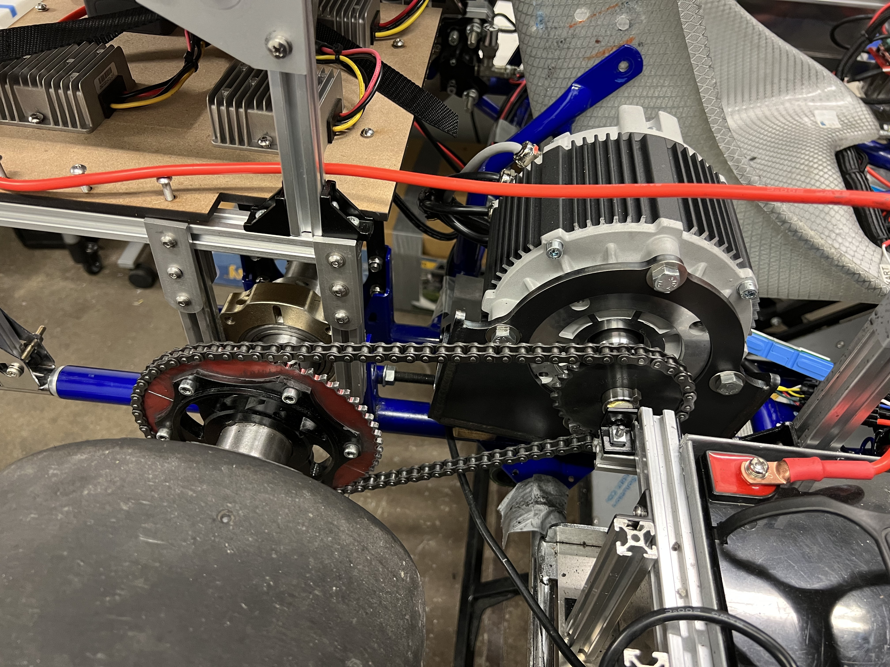
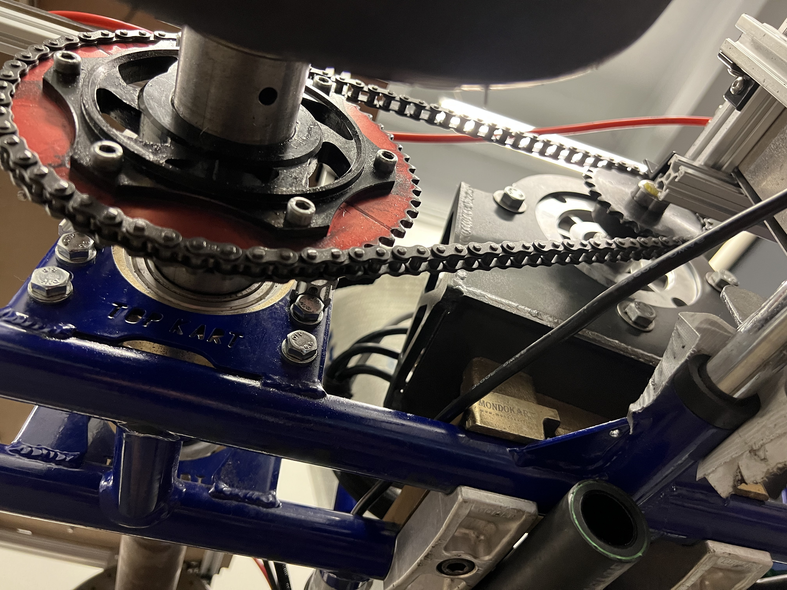
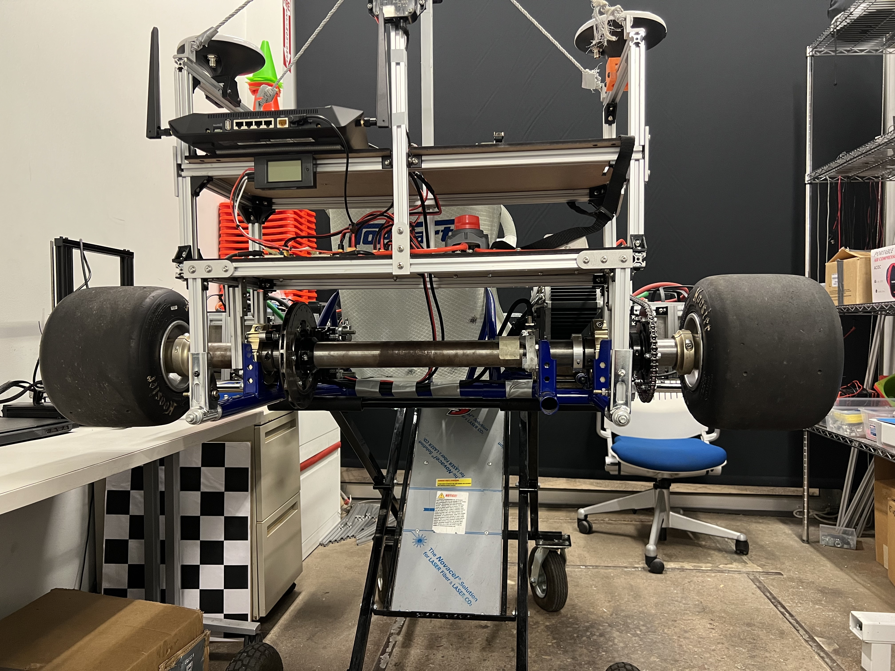

Throttle-by-Wire Mechanical assembly
====================================

Motor
--------

We started working with the Brushed DC motor and it worked well for the intial 2 version of our Gokart. However, it lacked the capacity of reverse and was also very inefficient. To combat this the team took the decision to pivot to a Brushless DC motor for the next version of the Gokart.

.. image:: ../imgs/Mechanical/TBW_left.jpeg
    :width: 400
    :align: center
    :alt: Motor

We chose the ME1716 BLDC for that. This motor comes with the sin cosin encoder. We are still trying to tune this sensor and will be sure to update the settings quite soon. In essence, if you find a motor which takes in 48V as the input, it can very easily be integrated with the setup.

VESC Controller
--------

In the :doc:`../../soft_req` section, we mention that we use the VESC controller to tune the motor and configure the settings. It is pretty easy to configure once the user is used to it. Here are some videos that will help you setup- 

- `VESC Setup <>`_

Motor mount
--------

The motor mount is used to hold the motor in place. The motor mount would have come with the Topkart chassis and after removing the original motor. To this mount you can attach the motor using 3 bolts. The motor mount has 4 holes that are used to attach it to the chassis.

Chain
--------

Chain is used to transfer the power from the motor to the rear axle. The chain is connected to the motor using a sprocket and then to the rear axle using another sprocket. The chain rests on the sproket and can be tightened or loosened by removing individual links using a specific tool. The chain should be tight enough so that it doesn't fall off the sprocket but not too tight that it puts a lot of stress on the motor. The chain should be lubricated regularly to avoid any friction at all times.

.. note:: 

    It's important to lubricate the motor as we found that it has significant effects on performance.

Speed sensor
--------

There are bunch of sensors that can be used to detect and predict the velocity/position of the motor while it's moving. The motors that we have used previously have sin cosine encoder, hall effect sensor and then we can also the AS5047P angle sensor data to measure the position of the motor shaft at any given point in time. For now, we have a velocity sensor which is basically a magnetic rotary encoder to measure the velocity of the car and provide that information to the nucleo.
The motor also has inherent sensors that can be used here. More details coming soon!

Tires
--------

Mention that the wheels should be pumped to 18-24 psi
The wheels should be pumped upto the required psi to get accurate and similar results each time we test the kart. The suggested range is between 18-24 psi. The team found that 21 psi worked well for the tires that we got from TopKart.

