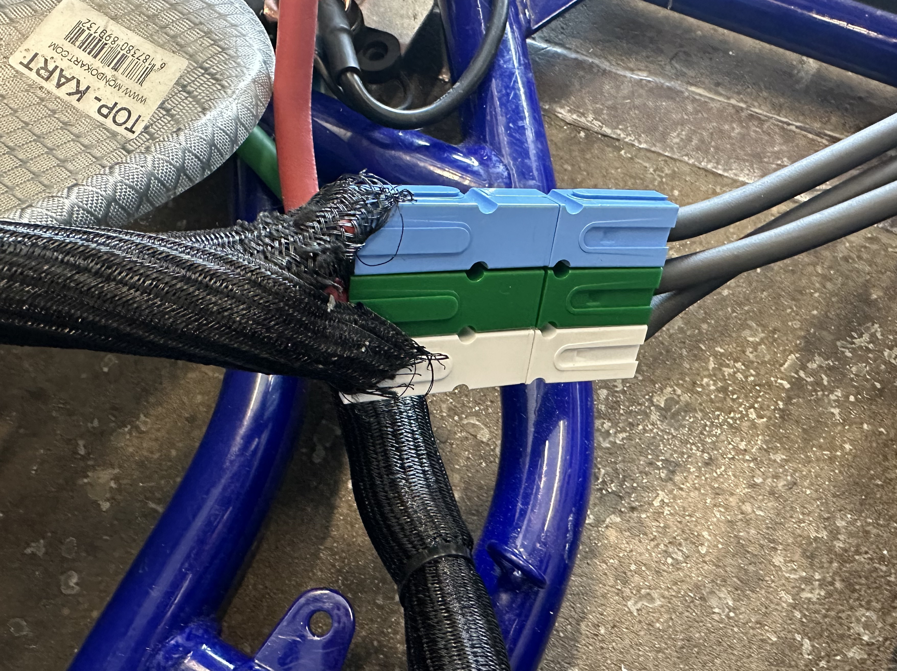
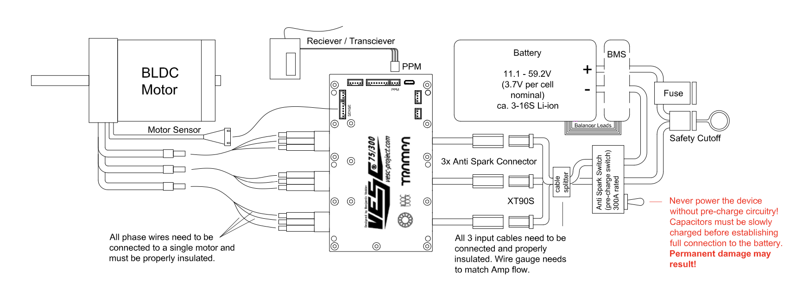
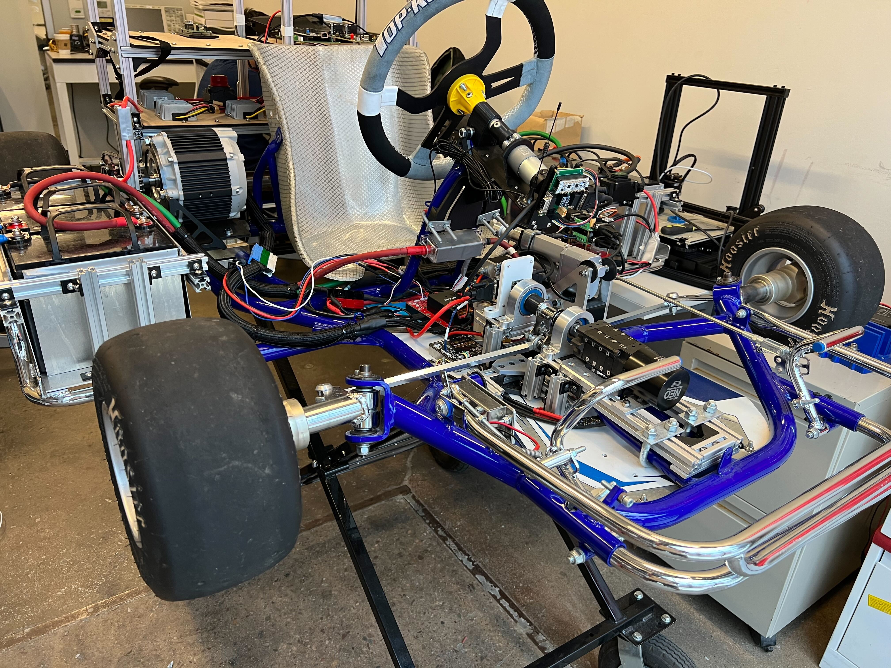
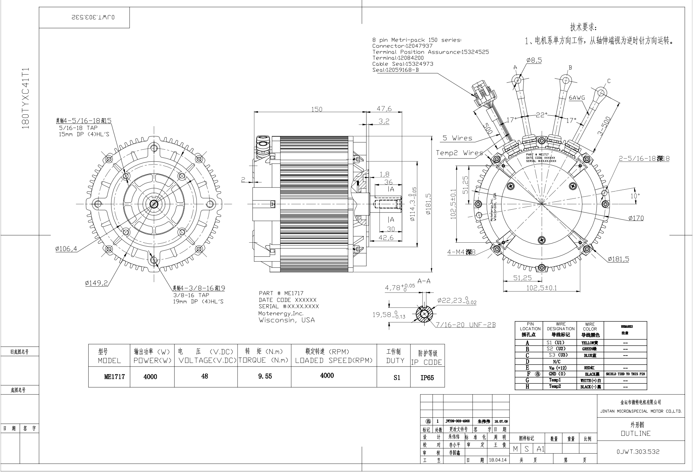

Throttle-by-Wire Mechanical assembly
====================================

TODO Add more detail to this section, double check everything

Motor
--------

ME1717 is a three-phase permanent magnet synchronous motor. Designed with an axial air gap, this motor stands out with its maintenance-free brushless design. 

Specifications
--------------

**Basic Features**:

- **Voltage**: 24-48V
- **Current**: 100A
- **Power**: 4 kW (Continuous)

**Performance Metrics**:

- **Speed**: 5000 RPM (can peak up to 5500 RPM)
- **Torque**: 9.55 Nm
- **Efficiency**: 88%

**Design and Build**:

- **Ingress Protection**: IP65 - ensures the motor is dust-tight and protected against water jets.
- **Sensor**: Hall Effect sensors for reliable performance monitoring.
- **Poles**: Designed with 5-poles (comprising 10 magnets).
- **Weight**: 20.5 lbs (equivalent to 9.3 kg) 

**Electrical Properties**:

- **Resistance (between phases)**: 4.9 milli Ohms
- **Inductance (between phases at 1000 Hz)**: Values range between 39 and 43.5 micro Henry.

Additional Features:

- **Temperature Sensor**: Yes, it's installed to monitor and ensure optimal performance. But we didn't test it yet.

Tutorial
--------

**1. Installation**:

Before installing, ensure the location chosen is free of excessive moisture and dust to take full advantage of the IP65 protection.

**2. Connections**:

Connect the three phases ensuring proper insulation. It's essential to verify the connections with the Hall Effect sensors for accurate performance metrics. For our design, we use SB50/PP75 SB Series Powerpole Loose Piece Contact and Anderson Powerpole Housing from Powerwerx to represent A, B, and C phases in three different color. 

here is the connector that we use: 
- `75 Amp Red/Black/Blue Anderson Powerpole Housing <https://powerwerx.com/5916g4-bk-anderson-power-black>`_
- `75 Amp White/Green Anderson Powerpole Housing <xhttps://powerwerx.com/5916g4-bk-anderson-power-black>`_
- `SB50/PP75 SB Series Powerpole Loose Piece Contact <https://powerwerx.com/5900-bk-anderson-power-6awg>`_

**3. Monitoring**:

Utilize the in-built temperature sensor to regularly check the motor's temperature during operation. Overheating can reduce efficiency and motor lifespan.

**4. Maintenance**:

Given its brushless design, the ME1717 requires minimal maintenance. Regularly check for any visible damage or wear.

**5. Safety**:

Always disconnect power when making any adjustments or checks. Use protective gear when necessary.

Here is the motor manual. The sensor pin color and loction is at the bottom of this img!

VESC Controller
--------

In the :doc:`../../soft_req` section, we mention that we use the VESC controller to tune the motor and configure the settings. It is pretty easy to configure once the user is used to it. Here are some videos that will help you setup- 

.. image:: ../imgs/Mechanical/vesc.png

Motor mount
--------

The motor mount is used to hold the motor in place. The motor mount would have come with the Topkart chassis and after removing the original motor. To this mount you can attach the motor using 3 bolts. The motor mount has 4 holes that are used to attach it to the chassis.

.. image:: ../imgs/Mechanical/TBW_motor.jpeg
    :width: 400
    :align: center
    :alt: Motor mount

Chain
--------

Chain is used to transfer the power from the motor to the rear axle. The chain is connected to the motor using a sprocket and then to the rear axle using another sprocket. The chain rests on the sproket and can be tightened or loosened by removing individual links using a specific tool. The chain should be tight enough so that it doesn't fall off the sprocket but not too tight that it puts a lot of stress on the motor. The chain should be lubricated regularly to avoid any friction at all times.

.. note:: 

    It's important to lubricate the motor as we found that it has significant effects on performance.

.. image:: ../imgs/Mechanical/TBW_gear.jpeg
    :width: 400
    :align: center
    :alt: Chain

Speed sensor
--------

There are bunch of sensors that can be used to detect and predict the velocity/position of the motor while it's moving. The motors that we have used previously have sin cosine encoder, hall effect sensor and then we can also the AS5047P angle sensor data to measure the position of the motor shaft at any given point in time. For now, we have a velocity sensor which is basically a magnetic rotary encoder to measure the velocity of the car and provide that information to the nucleo.
The motor also has inherent sensors that can be used here. More details coming soon!

Tires
--------

Mention that the wheels should be pumped to 18-24 psi
The wheels should be pumped upto the required psi to get accurate and similar results each time we test the kart. The suggested range is between 18-24 psi. The team found that 21 psi worked well for the tires that we got from TopKart.

.. image:: ../imgs/Mechanical/TBW_back.jpeg
    :width: 400
    :align: center
    :alt: Motor

