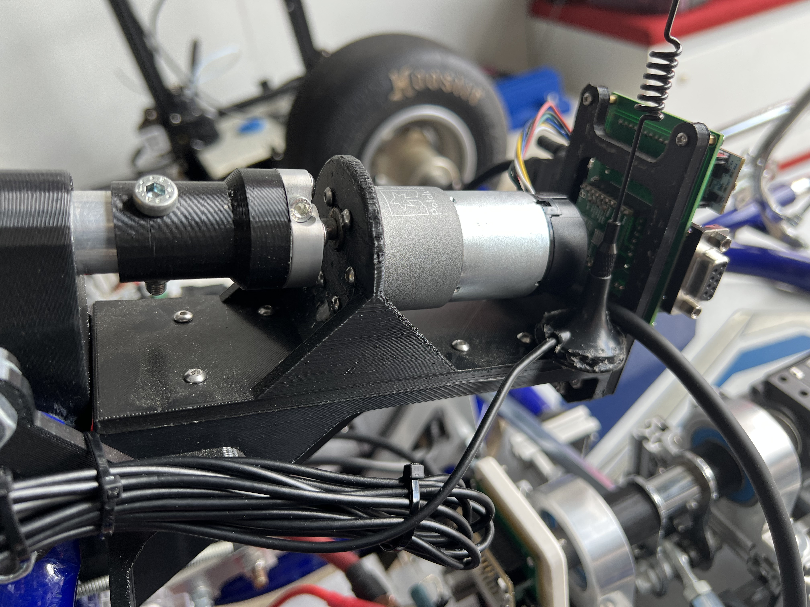
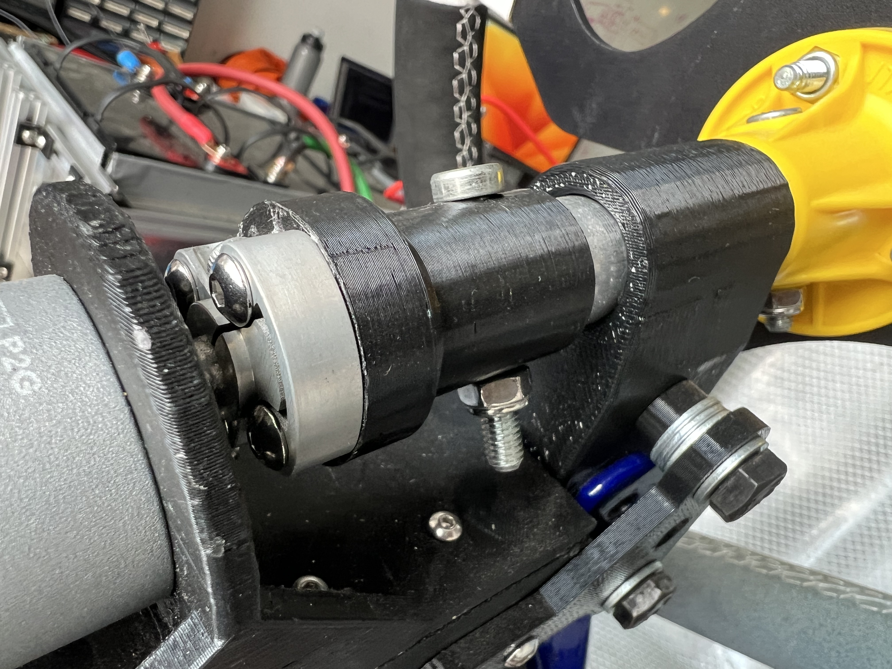
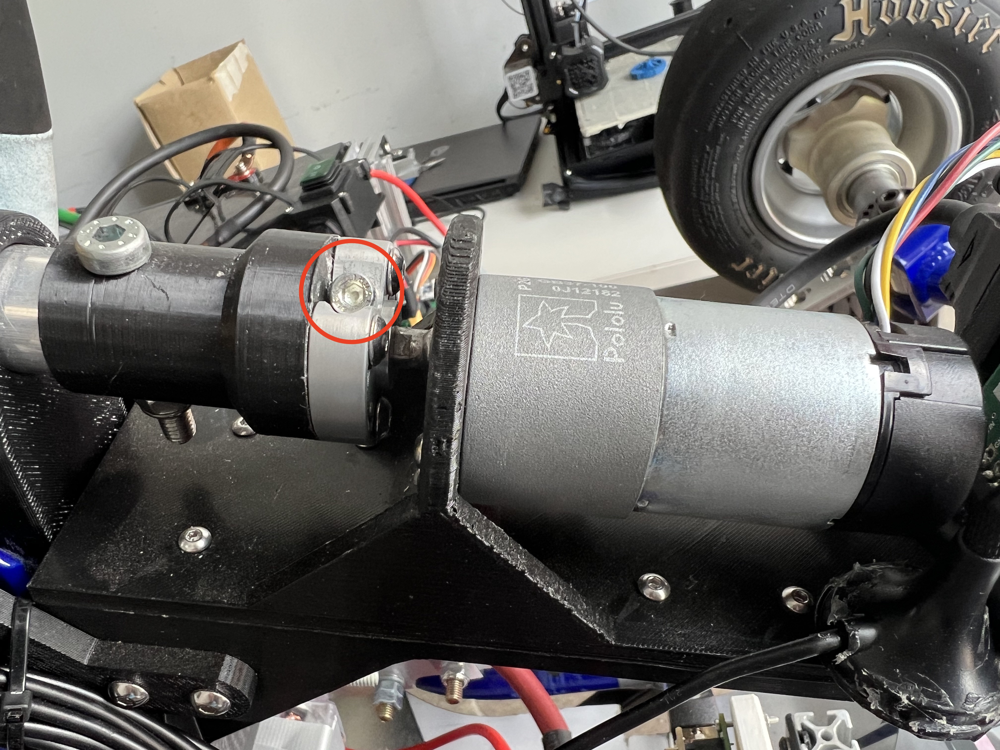
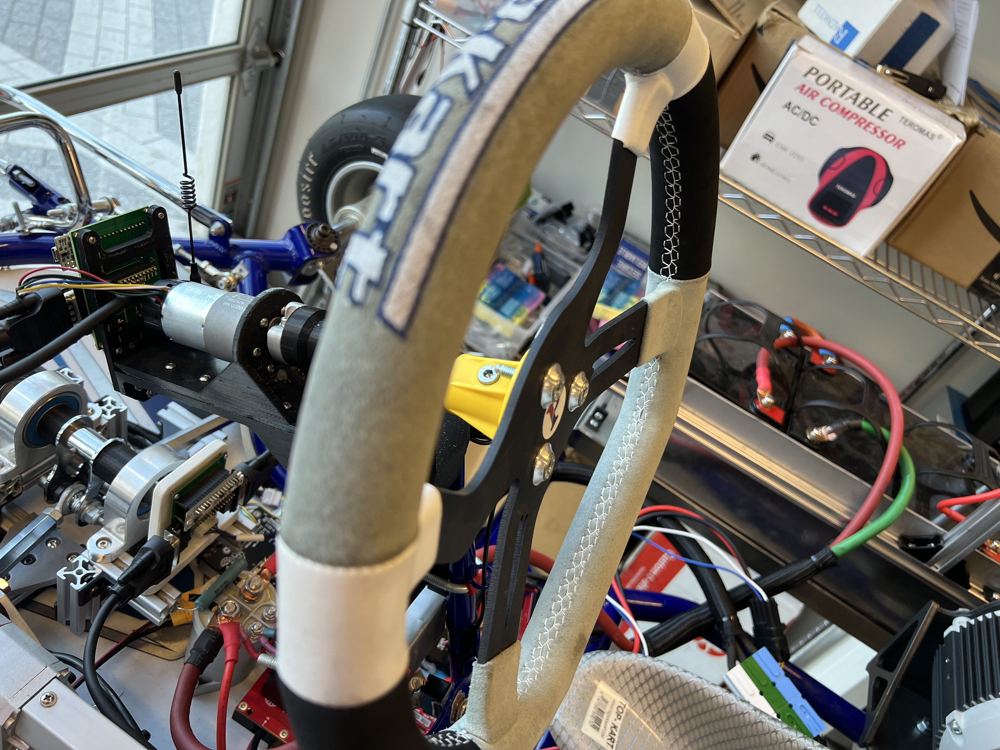
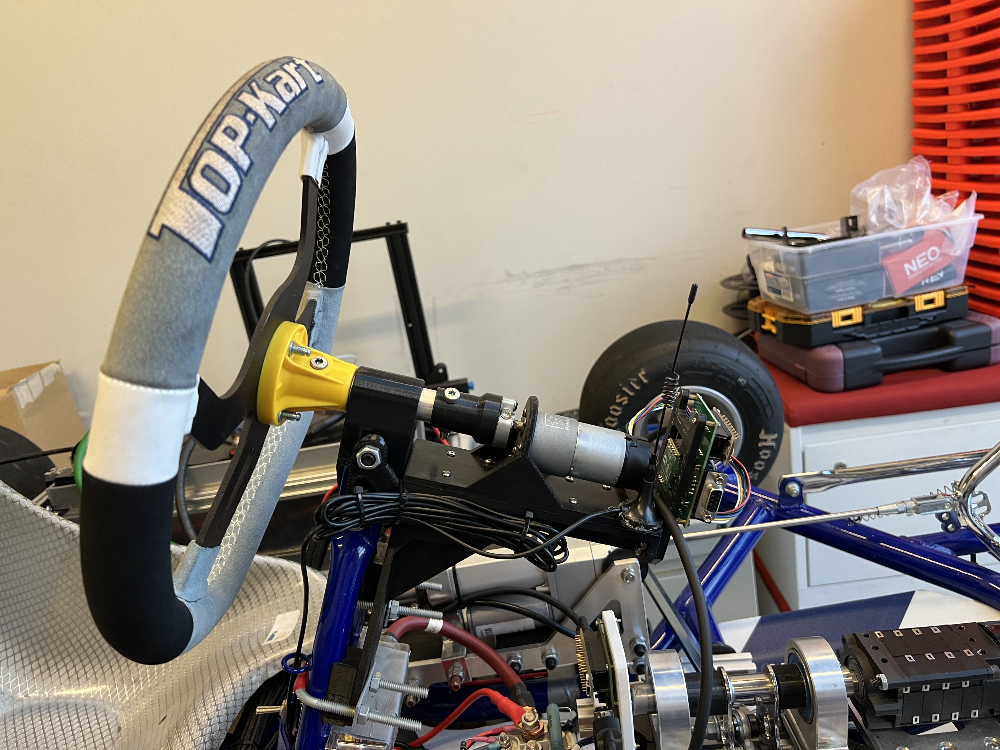
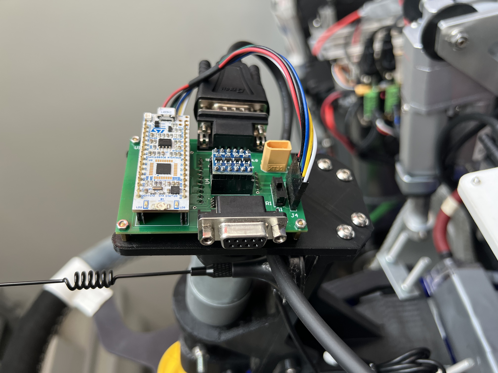
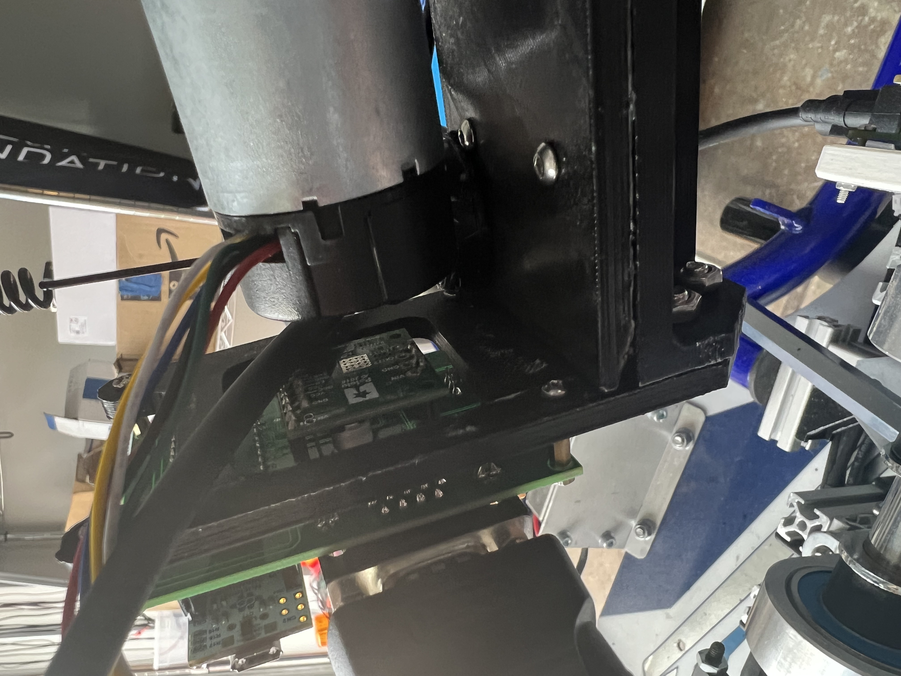
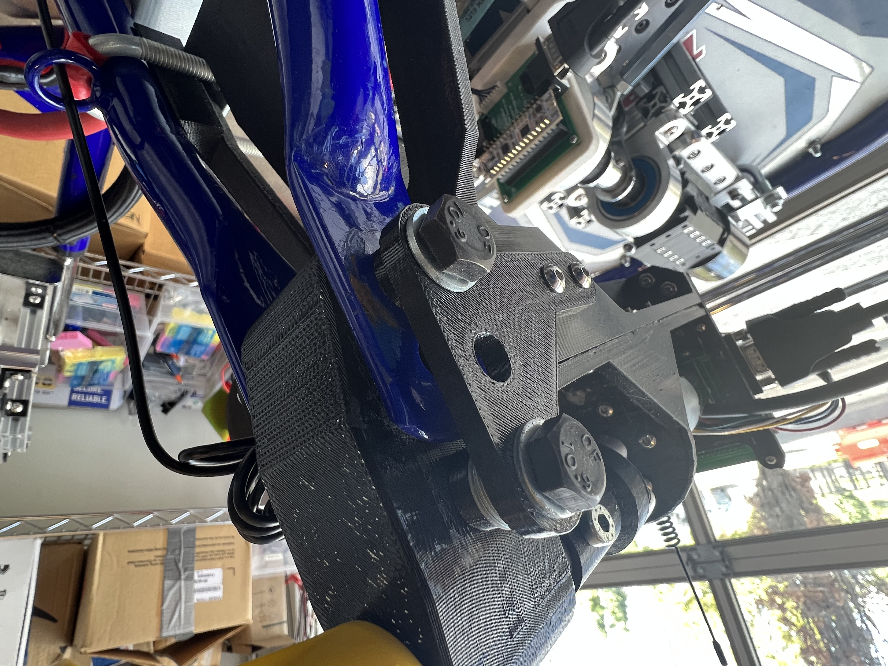
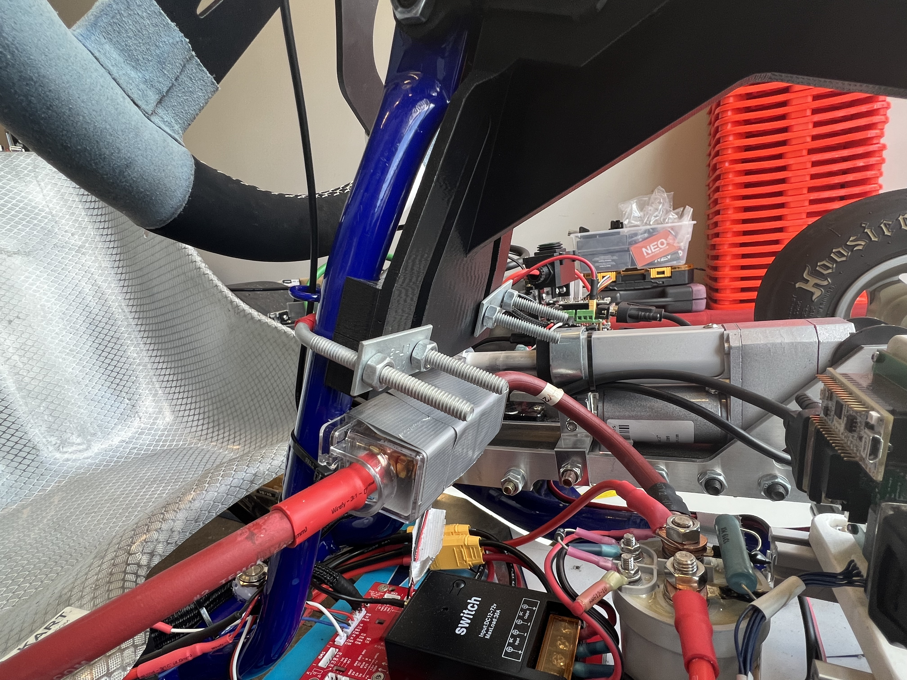
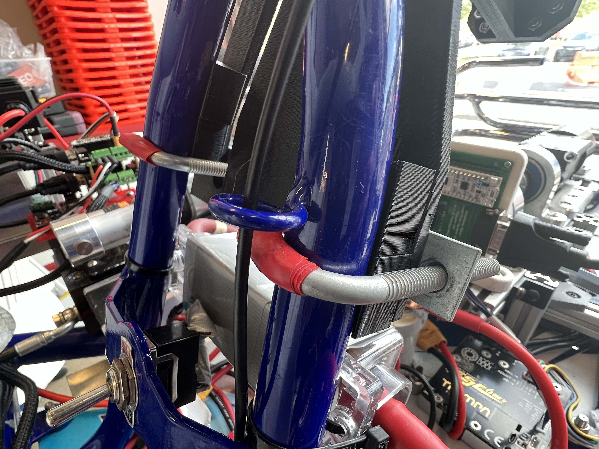

Upper Steer By Wire (U-SBW) Assembly
==================================

This is the assembly of the Upper Steer By Wire (U-SBW) Assembly in CAD. The assembly is shown below:

You can also view the exploded video view of the Assembly `here <https://drive.google.com/file/d/1NHFZQ1OP3V632oppj7N01TcItQowJsK4/view?usp=sharing>`_

This is the real life assembly of the L-SBW Assembly:

.. image:: ../imgs/Mechanical/SBW_3.jpg
    :width: 100%
    :align: center
    :alt: Upper Steer By Wire Assembly

.. image:: ../imgs/Mechanical/SBW_4.jpg
    :width: 100%
    :align: center
    :alt: Upper Steer By Wire Assembly

The Upper Steer-By-Wire is critical in order to interface with a human driver. The subsystem relies heavily on its steering wheel, which accepts user rotational input, captured by a quadrature encoder, and subsequently transmitted via the U-SBW Nucleo to the main GoKart nucleo. Within the parallel L-SBW subsystem, this signal then maps to some rotation of the front wheels, steering the car. Importantly, the encoder is actually nested within a Pololu motor (TODO Insert link), allowing the GoKart to actuate steering wheel rotation even without human input.

This features creates potential for future "hybrid-autonomy" mode implementation, where the GoKart used higher-level sensor input (LiDAR, camera, etc) to perceive its environment then plan and follow a path autonomously, but emply an onboard human driver for assistance. Since the steering wheel movements correspond with the car turns, a human driver can manually override these signals if necessary, for example if their intuition suggests that a more of less aggressive maneuver is necessary. By collecting this data, reinforcement learning can be implemented to teach the GoKart these intuitive maneuvers and improve the fully-autonomous mode moving forward.

Note that almost all components of this subsystem are 3D printed from plastic; Strong metal materials are unnecessary since this components carries a very small load, plus this subassembly is hanging in the air, so we prioritized weight reduction. In terms of assembly, it's most convenient to almost-entirely assemble this component first offboard, then attach it together to the existing GoKart. The steps can be laid out as follows:

Step 1: First, you will assemble the two primary structural components. These are called "beam" (`STL here <https://github.com/mlab-upenn/gokart-mechatronics/blob/main/Mechanical/SBW%20-%20upper/STL/beam.STL>`_) and "Pololu mount" (`STL here <https://github.com/mlab-upenn/gokart-mechatronics/blob/main/Mechanical/SBW%20-%20upper/STL/Pololu%20mount.STL>`_) both 3D printed, and both are circled in red and highlighted in light blue below. To attach them, simply use 8 screws (TODO figure out screw type) and nuts, fixturing through the provided 8 holes.

.. image:: ../imgs/Mechanical/USBW_CAD_1
    :width: 100%
    :align: center
    :alt: Upper Steer By Wire Assembly Step 1

Step 2: Locate the Pololu DC motor (TODO attach link), and attach it to the Pololu mount using 6 screws (TODO identify screw type). TODO Figure out rotor connection mechanism

Step 3: Locate the two identical "beam link" parts, `3D printed <https://github.com/mlab-upenn/gokart-mechatronics/blob/main/Mechanical/SBW%20-%20upper/STL/beam%20link.STL>`_, and attach them to the beam using four screws (two per side), TODO determine screw type. Note that the other, larger three holes are still vacant, these will be connected at a later step.

.. image:: ../imgs/Mechanical/USBW_CAD_3
    :width: 100%
    :align: center
    :alt: Upper Steer By Wire Assembly Step 3

Step 4: In a separate subassembly, connect the "coupler," `3D printed <https://github.com/mlab-upenn/gokart-mechatronics/blob/main/Mechanical/SBW%20-%20upper/STL/coupler.STL>`_ and the "D-shaft hub" (purchased, link coming soon). This can be done using four screws (type TBD, TODO). Note that you will have to thread the 3D printed coupler part, which can simply be done using the screw itself, after 3D printing a slightly undersized hole (TODO confirm this, check CAD for the part)

Step 5: Connect the two subassemblies from the previous steps. This can be done by inserting the hub around the motor's shaft, then screwing it in using two (TODO insert screw name) screws. Note that the coupler subassembly is not yet secure, so be extra careful until it accepts the steering wheel shaft.

Step 6: Locate the "shaft mount" part, `3D printed <https://github.com/mlab-upenn/gokart-mechatronics/blob/main/Mechanical/SBW%20-%20upper/STL/shaft%20mount.STL>`_. Then use a single (TODO) screw and nut, two copies of the "ABS washer" (one per side, `3d printed <https://github.com/mlab-upenn/gokart-mechatronics/blob/main/Mechanical/SBW%20-%20upper/STL/ABS%20washer.STL>`_), and several washers, to attach the shaft mount in between the two beam mounts, via their back top hole. Note that the shaft mount still has 1 degree of freedom; don't worry, this will be resolved in the next step.

TODO Insert image, CAD after first taking it

Step 7: Locate the "sw shaft" part (metal pipe, engineering drawing coming soon), and connect it into the assembly. Slide it first into the shaft mount, then into the coupler. Next, use a (TODO) screw and nut to attach the coupler and pipe. Some shaft should remain sticking out the back.

.. image:: ../imgs/Mechanical/USBW_IRL_7
    :width: 100%
    :align: center
    :alt: Upper Steer By Wire Assembly Step 7

Step 8: In a new subassembly, connect the "steering wheel" to the "sw mount," both parts provided by TopKart (TODO check they're both provided, and check the material). This can be done using three (TODO) screws and nuts.

Step 9: Connect this new steering wheel assembly to the remaining assembly by passing the sw mount around the sw shaft, and connecting them via a single screw and nut (TODO).

Step 10: Create a new subassembly for the boards. For this, you'll need the USBW PCB (custom designed, see Electrical section of documentation), the Pololu motor driver (comes with motor purchase), and the "USBW PCB mount," `custom 3D printed <https://github.com/mlab-upenn/gokart-mechatronics/blob/main/Mechanical/SBW%20-%20upper/STL/USBW%20PCB%20mount.STL>`_. First, make sure all components necessary are soldered to the PCB. Note that the Pololu driver is soldered to the back, but everything else (including nucleo, CAN bus ports, etc) is on the front. It is recommended that you use some black solder elevation/bridge parts in between parallel components, as we did. After the electronics are all assembled, attach them (via the USBW PCB) to the PCB mount, via 4 screws, nuts, and standoffs (TODO figure out which type). The motor driver will fit nicely into the mount's large rectangular pocket. Your result should look similar to the next two images below.

Step 11: Connect this new PCB subassembly with the remaining assembly using 4 screws and nuts (TODO get type of screw) near the bottom. 

Step 12: Now you're ready to connect the full USBW assembly into the preexistent GoKart assembly. This will require three final connections to be made

Step 12a: Place the USBW subassembly's shaft mount inside the blue TopKart chassis's upper steering wheel tabs, with the two beam links just outside of those tabs. Then, insert two more copies of "ABS washer," namely one in between each tab and its corresponding beam link, so that the full sequence (from beam link to beam link) is very tight. Then, using a screw (TODO get screw type), nut, and washer, tighten this sequence permanently. At this point, the entire USBW subsystem should be attached to the GoKart, even though the bottom is loose.

Step 12b: Locate four identical "rounded spacer" parts, `3d printed <https://github.com/mlab-upenn/gokart-mechatronics/blob/main/Mechanical/SBW%20-%20upper/STL/rounded%20spacer.STL>`_, and two U-bolts, 2 rectangular plates (TODO get link, correct the name), and four nuts. First, coat the U-bolt's rounded edge with a few layers of Gaffer's tape (or a similar material). Then near the bottom of the beam, attach the components to either side as shown below, tightening them with the four nuts. Note that the spacers need not all be perfectly tight.

