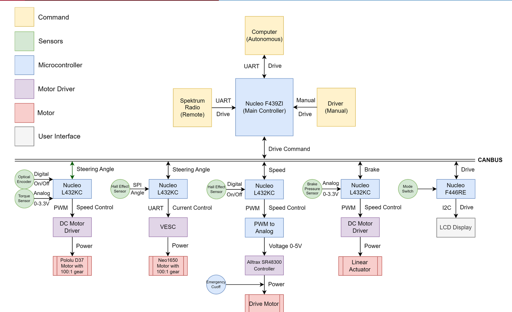
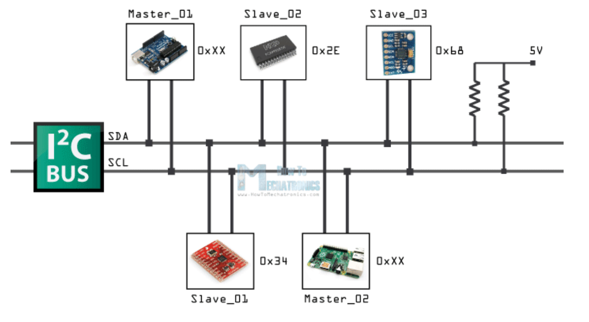
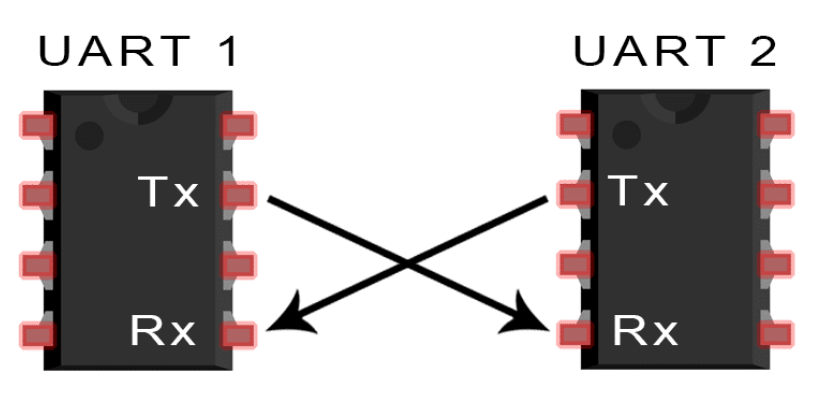
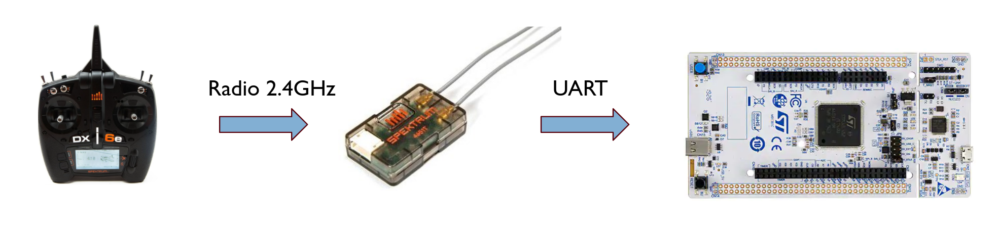

==================================
Communications
==================================

Introduction
============

The most important aspect for any project is communication. This document pertains information on how to set it up and gives some guidelines on how to use it.

Throughout the Go-Kart we have 2 basic types of communication:

Wired comms
=========
Wired communications lay the ground work for the entire system. It is the most important aspect of the entire system. We have 3 types of wired communications:
CAN buses
I2C buses
UART 

CAN buses
--------------
CAN buses are used to communicate between the different modules. They are very popular modes of communication for embedded electronic devices specifically systems which require reliable, multi device communciation like automotive systems, industrial robots. We have a central CAN bus running through the whole system. The CAN bus ensures efficient communication between the main nucleo F439ZI with the rest of the NUCLEO L432KC. Commands such as steering angle, speed, brake and drive are talked by the system over the CAN bus.

I2C buses
--------------
I2C communication known as IIC is a synchronous multi master slave packet switched single ended serial communication bus. It used two wires known as SDA and SCL to communicate data over the channel. Here, for our system the I2C bus is used to relay information to the LCD screen. The LCD screen denotes the total power consumed, voltage across the control circuit and other information for the operator.

UART
--------------
UART is a straightforward serial communication protocol that requires two wires: TX (Transmit) and RX (Receive). It is used for point-to-point communication between the microcontroller and a single sensor. UART is often employed for simple and straightforward sensor applications. Here, for our system we use UART for comunicating with the Upper steer by wire VESC and communicating with the remote reciever. The VESC is used to control the steering angle of the go-kart and the remote reciever is used to control the speed of the go-kart. 

Wireless comms
=========
Wireless communications are useful for the system in a variety of ways. We have 2 types of wireless communications.

Transmitter-Reciever link
--------------
We add a 2.4Ghz Radio link between the remote and the reciever. This is used to control the speed of the go-kart. The remote has a joystick which is used to control the speed of the go-kart. The reciever is connected to the main nucleo F439ZI which then relays the information to the TBW Nucleo sends the information to the motor controller. The motor controller here VESC75/300 then controls the speed of the go-kart. 

Safety switch link
--------------
As we saw in the PDU/wiring section, we have a contactor to prevent the motor subsystem from getting power. Thus, this safety switch link (also called the Estop) is used to switch the power on/off to the system. There are 2 other switches on the car itself which are a part of this system. However, the Estop supercedes them all. 

**ADD IMAGE HERE**

Protocols 
=========
There are a variety of different protocols being used in the entire system. Here we will give a brief overview of why and where the protocols are used.
**CAN**
**I2C**
**UART**
**Radio**
**SPI**

Working tips
=================

.. warning::

   We shall ensure to test communication between each module before we integrate them together. This will ensure that we do not have to debug the entire system at once.
