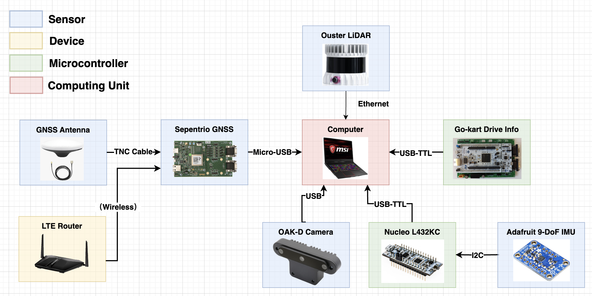

==================================
Compute & Sensing
==================================

.. |Link1| raw:: html

   <a href="https://github.com/mlab-upenn/gokart-sensor/tree/ros2_foxy_purepursuit">ROS2 Foxy setup and autonomous code</a>

.. |Link2| raw:: html

   <a href="https://github.com/mlab-upenn/gokart-sensor/tree/ros2_humble_purepursuit">ROS2 Humble setup and autonomous code</a>

Introduction
============

The Go-Kart project has significant planning and other high level navigation components which require understanding of the compute system and how it's setup.

Laptop
=========   
The Laptop is the main compute system for the Go-Kart. It is used for running the high level navigation stack and connects to the Nucleo using a USB interface for low level control stack. The laptop is connected to the Go-Kart via ethernet and is powered by a 12V battery. There is also a provision from the PDU to provide power to the laptop's battery so that it can run on high performance as well as not run out at any given time. We are using the MSI __ with GPU ___. The laptop is mounted on the Go-Kart using a laptop mount. The laptop mount is mounted on the rear shelf of the Go-Kart. Below is the system overview. \

Sensors
=========
The Go-Kart has a variety of sensors which are used for navigation, control and perception. The sensor system enables research and development in perception, sensor fusion and localization for autonomous racing. Through its position at the beginning of the pipeline for autonomous vehicles, perception plays an essential role and directly influences the performance of all subsequent systems. To enable safe and predictable behavior for different use cases, the go-kart platform offers multiple capabilities to detect and track objects, lanes, and markers in its environment and determines its current position reliably. This section introduces
some of the sensing capabilities in the go-kart and their accompanying algorithms. This section will describe the sensors specifically used for navigation and perception. 

Overview
--------------
Object Detection enables the vehicle to perceive its environment and derive information from it. The go-kart offers different capabilities to detect objects necessary for its perception of the environment for street use, with lane detection and the detection and tracking of other road users. In addition, these capabilities are applied to racetracks with cone detection and opponent tracking. Depending on the application, a single sensor (e.g., YOLO on one camera), single sensing modality (e.g., CenterPoint on one short-range LiDAR and one long-range LiDAR), or multi-modality approach, including early fusion, late fusion and deep fusion, (e.g., deep fusion with Centerpoint and ResNet ) is applicable.Using multiple sensors requires knowledge about the relative position of each sensor frame respective to the other.

Sensor calibration algorithms offer this capability and find corresponding key points in both data sets, allowing an op- timization algorithm to determine the fusion parameters. The go-kart platform offers two different methods. Depending on the number of sensors used, either a single LiDAR to single camera method or an algorithm to simultaneously calibrate multiple LiDAR and camera sensors is available. In addition, the go-kart possesses the capability to localize itself using methods such as the LiDAR or GNSS position tracking to enable research on graph-SLAM, ICP, vision-based SLAM, and other emerging research areas. 

LIDAR
--------------
The Go-Kart system has an Ouster LIDAR which is used for perception and navigation. The LIDAR is mounted on the rear shelf of the Go-Kart and is used for obstacle detection and avoidance. The LIDAR is also used for localizing the Go-kart on the track by working with SLAM algorithms such as EKF SLAM, GRAPH SLAM and more. The LIDAR is connected to the compute system (aka Laptop) via ethernet.

Camera
--------------
We use the OAK-D camera to run perception related tasks on the Go-Kart. It connects to the main compute system using USB.

GNSS
--------------
The Go-Kart system has a GNSS system which is used for localization. The GNSS system is mounted on the rear shelf of the Go-Kart and is used for localization of the Go-Kart on the track. The GNSS system is connected to the compute system (aka Laptop) via USB. The interface and how to setup the communication is described in the readme of the github. Please find the links at the bottom of this page.

Single-Modality Object Detection
----------------------------------

YOLO offers object detection, segmentation, and classification in one algorithm. Additional benefits include a good generalization, fewer false positives for backgrounds, and the potential of real-time processing. To run object detection, we deploy multiple versions on the go-kart, including Darknet YOLOv3 and YOLOv8. For cone detection in the Autonomous Karting Series (successor of EvGrandPrix ), we created a dataset with over 5000 images and the corresponding annotations . Each network is trained with Darknet  or via the ultralytics Python API . Gosala et al. present a cone detection algorithm using the dimensional properties of cones with a uniform shape. 

In the initial step, the ground points are removed and sub- sequently clustered. The number of points in one cluster is compared to an expected number based on the height and width of the cone, distance, as well as angular and vertical resolution of the LiDAR sensor. Initial experiments show a large number of false detections, especially regarding Fig. 3. Sensing system hardware setup overview columns and flag poles. We introduce an additional constraint  to overcome this limitation, comparing the number of points in the top and bottom quarters of the cluster. The cluster is dropped if this quotient doesn’t meet a certain threshold. CenterPoint uses an end-to-end learning approach to detect cones in 3D point clouds. CenterPoint’s generic LiDAR back- bone creates a map representation of the LiDAR point cloud input. The detection head flattens the map representation into a bird’s-eye view and extracts the object centers with a key point detector. The features are saved at the object’s center point. A second stage refines the detection results. 

Sensor calibration
----------------------------------

Algorithms using more than one sensor require extrinsic calibration to provide the pose and orientation with respect to other sensors. Pandey et al. enable the fusion of a single LiDAR and camera sensor. A checkerboard fastened on a flat surface represents the calibration tool. The target is easy to recognize for LiDAR by the flat side and the camera because of the geometric properties of the checkered pattern. We use a checkerboard with 8×6 vertices and a square size of 55 millimeters.

Domhof et al. propose a method that can fuse multiple LiDAR, camera, and radar sensors at the same time. The system allows for relative transformation between the sensors, as well as absolute transformation in regard to the vehicle. The algorithm uses a custom calibration target made from Styrofoam. The target has a size of 1 meter by 1.5 meters with 4 circular holes with a diameter of 15 centimeters placed around the middle. An additional corner reflector can be placed in the middle to enable the inclusion of radar sensors. The LiDAR and camera sensors detect the 4 holes and return the center points. Since camera images only contain 2D data, the known dimensions of the holes and a camera projection matrix allow a calculation of the 3D position. To facilitate the hole detection, we increase the size of the calibration target by 50 percent and precisely manufacture it in a Styrofoam CNC machine.

Multi-Modality Object Detection
----------------------------------

Early fusion combines data at a raw data level instead of a decision level. In the initial step, object detection is performed on the camera image. Subsequently, the raw LiDAR data is mapped onto the image. Euclidian clustering is performed on the LiDAR data to remove the background points. In Fig. 5, we show the early fusion and detection of traffic cones through their corresponding clusters. 

During late fusion, each sensor runs its individual object detection pipeline, with the data being fused afterward. The first version we implement runs the geometric-based LiDAR detector and Darknet YOLOv3 network. Both sensors output a confidence per possible cone detection. If both sensors detect a cone and have a combined confidence higher than a certain threshold, the detection is assumed to be true. The second version uses CenterPoint as LiDAR-based object detection instead and incorporates the same validation metric.

Localization
----------------------------------
With the knowledge of the go-kart’s environment, Google Cartographer provides an effective localization and mapping method. The go-kart platform uses the Ouster LiDAR’s long range data in up to 360 degrees for scan matching, supporting  the RTK-GNSS and IMU for localization. Cones are added as landmarks. Each newly detected cone is assigned a unique identification number. Once a cone reappears its position is compared with all previously detected landmarks. It is assigned the ID of the closest cone.

Sensor Layout
----------------------------------
The sensor layout allows the setup to be adjusted for different research tasks. A Velodyne M1600 solid-state LiDAR and OAK-D camera are placed at the front of the kart. Both sensors are suited for short-range object detection with an identical horizontal field of view (FOV) of 120 degrees. The Ouster OS1 has a longer range, 360-degree FOV, and a narrower vertical FOV. The LiDAR needs to be placed at least at the object’s height to detect it in its entirety. This is due to the elevation angle of the sensor going from 0 degrees to -22.5 degrees. The Ouster is placed with an OAK-Mono camera at the rear of the go-kart, which offers long-range object detection. The ideal place for the IMU is in the center of gravity. Otherwise, further conversions and corrections would be required. The RTK-GNSS antennas are mounted on the highest point of the go-kart to allow for a clear sky view. The antennas are connected to a mosaic-H board offering support for multiple satellite systems and Real-Time Kinematics 

Working tips
=================

.. warning::

   Always ensure your remote system is working well before getting into working with the autonomous stack.

Github
==========

Here you can find information about the pre-developed algorithms for the navigation of the Go-kart by the mlab at the University of Pennsylvania.

* |Link1|
* |Link2|
