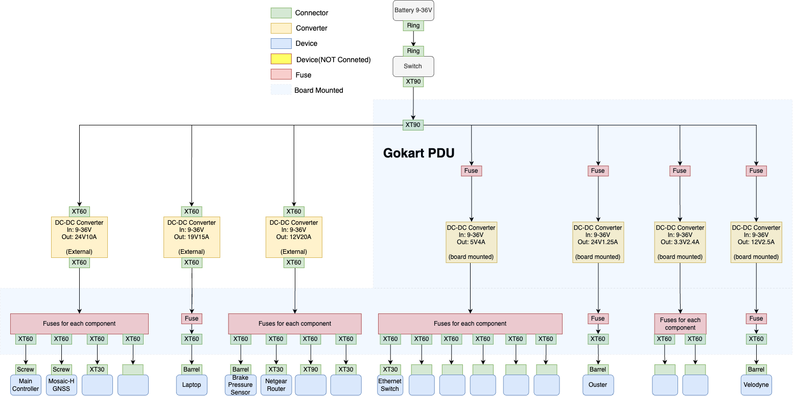
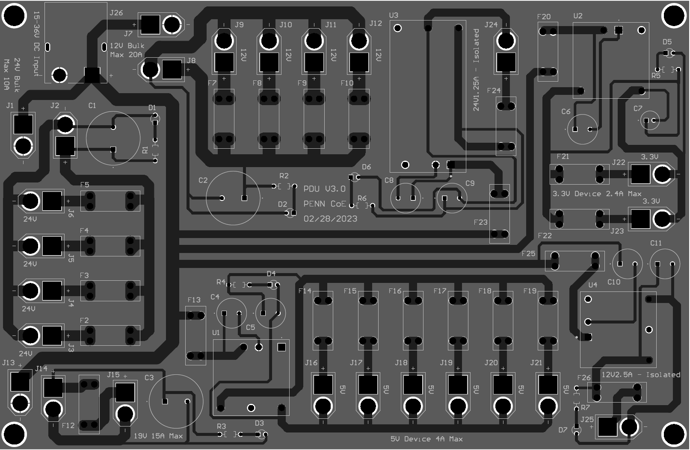

Mechatronics 
=====

The go-kart mechatronics system is designed as a modular
system, consisting of several subsystems that are responsible
for different tasks. There are six major subsystems: Power
Distribution (PD), Main Control (MC), User Interface (UI),
Throttle-by-Wire (TBW), Brake-by-Wire (BBW), and Steerby-Wire (SBW). The “x-by-wire” system design approach has
been gaining popularity in the automotive industry which is to
replace conventional mechanical and hydraulic control systems
with electronic signals. The elimination of traditional
mechanical components could increase control stability, increase design flexibility, reduce cost, and improve efficiency. In our go-kart drive-by-wire design, all subsystems
except the PD use an STM32 Nucleo development board on
a standalone PCB as the electronic control unit (ECU). Like
modern vehicle design, communication is achieved using the
controller area network (CAN) to allow efficient information
exchange between nodes. These modular control systems
are integrated with the original go-kart chassis in a nonintrusive manner and are easy to understand, build, and modify.

Power Distribution Subsystem
-----------------------------

1. Feature
~~~~~~~~~~~~~~~~~~~~~~

Dual Input:
++++++++++++

2x 12V battery input with XT90 connectors, offering flexibility in battery selection and redundancy for increased reliability.

Fuse Protection:
+++++++++++++++++
Each component has an individual fuse, ensuring protection against overcurrent and short circuits.

Multiple DC-DC Converters:
++++++++++++++++++++++++++++

+--------------------------+------------------------+
| High-Current 24V         | Laptop Charger 19V     |
| Converter                | Converter              |
+--------------------------+------------------------+
| Auxiliary 12V Converter  | Isolated 5V Converter  |
+--------------------------+------------------------+
| Isolated LIDAR 24V       | Isolated LIDAR 12V     |
| Converter                | Converter              |
+--------------------------+------------------------+
| Isolated 3.3V Converter  |                        |
+--------------------------+------------------------+

2. Description
~~~~~~~~~~~~~~~~~~~~~~

The Power Distribution Unit (PDU) V3, designed for the Autoware Autonomous Gokart Team at the University of Pennsylvania, is a highly efficient and versatile power distribution board. The PDU V3 takes input from two 12V batteries and distributes power through various voltage outputs to various devices. The board features a combination of external and in-board isolated DC-DC converters, fuses for overcurrent protection, and XT60 connectors for secure power distribution.

3. Specification of Board
~~~~~~~~~~~~~~~~~~~~~~~~~~~~~~~~~~~~~~~~~~~~

+------------------------+-------------------+
|               General                      |
+------------------------+-------------------+
| Board Size             |230.00mmx150.00mm  |
+------------------------+-------------------+
| Components on board    | 78                |
+------------------------+-------------------+
|             Routing Information            |
+------------------------+-------------------+
| Routing completion     | 100.00%           |
+------------------------+-------------------+
| Connections            | 163               |
+------------------------+-------------------+
| Connections routed     | 163               |
+------------------------+-------------------+
|              Layer / Sq.mm                 |
+------------------------+-------------------+
| Top Layer              | 9891.453          |
+------------------------+-------------------+
| Bottom Layer           | 32700.357         |
+------------------------+-------------------+

4. Layout
~~~~~~~~~~~~~~~~~~~~~~

Figure 1. Layout of Power Distrubution Board

Note: This product should be installed and operated by qualified
personnel only. Ensure proper input voltage is supplied to the board to
avoid damage to the components. For additional protection, use a
separate surge protector or voltage regulator. Do not exceed the maximum
output current for each output. Disconnect power before making any
adjustments or modifications to the board. Use proper wiring and
connectors to ensure secure connections and reduce the risk of short
circuits or other electrical hazards. Keep the board in a dry and
well-ventilated area to prevent condensation and overheating.

5. Devices
~~~~~~~~~~~~~~~

+----------+-----------+-----------------------------------------------+
| **Name** | **Unit    | **Purchasing Link**                           |
|          | price     |                                               |
|          | ($)**     |                                               |
+----------+-----------+-----------------------------------------------+
| EEU-     | 2.67      | https                                         |
| TA1J221S |           | ://www.digikey.com/en/products/detail/panason |
| C        |           | ic-electronic-components/EEU-TA1J221S/2689962 |
| apacitor |           |                                               |
+----------+-----------+-----------------------------------------------+
| EEU-     | 0.96      | https                                         |
| TA1H101B |           | ://www.digikey.com/en/products/detail/panason |
| C        |           | ic-electronic-components/EEU-TA1H101B/2689918 |
| apacitor |           |                                               |
+----------+-----------+-----------------------------------------------+
| C        | 0.09      | https://www.digikey.com/en/products/detai     |
| FR16J1K0 |           | l/te-connectivity-passive-product/CFR16J1K0/3 |
| Resistor |           | 317907?s=N4IgTCBcDaIMIDEBKBGAbAKRQaQAwgF0BfIA |
+----------+-----------+-----------------------------------------------+
| O        | 0.44      | https://www.digikey.com/en/products/detail    |
| VLAW4CB7 |           | /tt-electronics-optek-technology/OVLAW4CB7/18 |
| LED      |           | 43572?s=N4IgTCBcDaIPIDUAyBBA6gFgMICEDsIAugL5A |
+----------+-----------+-----------------------------------------------+
| 3557-2   | 1.10      | https://www.digikey.com/en/produc             |
| Fuse     |           | ts/detail/keystone-electronics/3557-2/2137305 |
+----------+-----------+-----------------------------------------------+
| PDQE20-  | 23.67     | https://www.digikey.com/en/prod               |
| Q24-S5-D |           | ucts/detail/cui-inc/PDQE20-Q24-S5-D/10230156? |
| c        |           | s=N4IgTCBcDaIAoBECKBRMAGAtEsAWTAygKyYIgC6AvkA |
| onverter |           |                                               |
+----------+-----------+-----------------------------------------------+
| PDQE10-  | 17.07     | https://www.digikey.com/en/pr                 |
| Q24-S3-D |           | oducts/detail/cui-inc/PDQE10-Q24-S3-D/9521937 |
| C        |           |                                               |
| onverter |           |                                               |
+----------+-----------+-----------------------------------------------+
| PYBE30   | 33.83     | https://www.digikey.com/en/p                  |
| -Q24-S24 |           | roducts/detail/cui-inc/PYBE30-Q24-S24/9859976 |
| C        |           |                                               |
| onverter |           |                                               |
+----------+-----------+-----------------------------------------------+
| PDQ30-Q  | 42.50     | https://www.digikey.com/en/pro                |
| 24-S12-D |           | ducts/detail/cui-inc/PDQ30-Q24-S12-D/6165425? |
| c        |           | s=N4IgTCBcDaIAoBECKBmADAWiWALBgygIxgYIgC6AvkA |
| onverter |           |                                               |
+----------+-----------+-----------------------------------------------+
| 24V10A   | 49.99     | https                                         |
| Bulk     |           | ://www.amazon.com/Stabilizer-Converter-Waterp |
| C        |           | roof-Regulator-Transformer/dp/B097CYG8HG?th=1 |
| onverter |           |                                               |
+----------+-----------+-----------------------------------------------+
| 12V20A   | 54.99     | https                                         |
| Buld     |           | ://www.amazon.com/Stabilizer-Converter-Waterp |
| C        |           | roof-Regulator-Transformer/dp/B097BLH4HC?th=1 |
| onverter |           |                                               |
+----------+-----------+-----------------------------------------------+
| 19V15A   | 21.00     | https://www.amazon.com/dp/B08J7M              |
| Bulk     |           | BJ7B?psc=1&ref=ppx_yo2ov_dt_b_product_details |
| C        |           |                                               |
| onverter |           |                                               |
+----------+-----------+-----------------------------------------------+
| XT30     | 12.99     | htt                                           |
| C        |           | ps://www.amazon.com/gp/product/B0875MBLNH/ref |
| onnector |           | =ppx_yo_dt_b_asin_title_o01_s00?ie=UTF8&psc=1 |
+----------+-----------+-----------------------------------------------+
| XT90     | 9.58      | htt                                           |
| C        |           | ps://www.amazon.com/gp/product/B09QJRHC19/ref |
| onnector |           | =ppx_yo_dt_b_asin_title_o00_s00?ie=UTF8&psc=1 |
+----------+-----------+-----------------------------------------------+
| XT60     | 7.99      | htt                                           |
| C        |           | ps://www.amazon.com/gp/product/B07VRZR5TL/ref |
| onnector |           | =ppx_yo_dt_b_asin_title_o06_s00?ie=UTF8&psc=1 |
+----------+-----------+-----------------------------------------------+
| XT60     | 7.98      | htt                                           |
| E        |           | ps://www.amazon.com/gp/product/B08GPRGQZX/ref |
| xtension |           | =ppx_yo_dt_b_asin_title_o01_s00?ie=UTF8&psc=1 |
| Cable    |           |                                               |
+----------+-----------+-----------------------------------------------+

Table 2. PDU Device and Purchasing Link

6. Battery Recommendation
~~~~~~~~~~~~~~~~~~~~~~~~~~

Input Voltage: Dual 12V batteries

-  Interstate Batteries SLA1155

-  Capacity: 12V, 35Ah

-  Weight: 10.97 kg

-  Dimension: 7.76 x 5.16 x 6.26 inches

-  Price: $89.99

-  Nerwak Model 1250 LIFEP04

-  Capacity: 12V, 50Ah

-  Weight: 4.8 kg

-  Dimension: 7.59 x 5.11 x 6.14 inches

-  Price: $169.99

-  Power Connectors: XT90

7. Schematic
~~~~~~~~~~~~~~~~~~~~~~

..

   .. image:: vertopal_89473492f87843d38ce69ba576e4f6e0/media/image3.png
      :width: 5.9887in
      :height: 4.07145in
      :scale: 50%

   Figure 2. External non-isolated DC-DC converter (24V, 10A) with 4
   ports for Peplink LTE and three additional unused ports

   .. image:: vertopal_89473492f87843d38ce69ba576e4f6e0/media/image4.png
      :width: 6.46011in
      :height: 1.89552in
      :scale: 50%

   Figure 3. External non-isolated DC-DC converter (19V, 15A) with 1
   port for Laptop Charger.

   .. image:: vertopal_89473492f87843d38ce69ba576e4f6e0/media/image5.png
      :width: 6.53267in
      :height: 4.30461in
      :scale: 50%

   Figure 4. External non-isolated DC-DC converter (12V, 20A) with 4
   ports for PWM-VCC Converter, Brake Pressure Sensor, and two unused
   ports.

   .. image:: vertopal_89473492f87843d38ce69ba576e4f6e0/media/image6.png
      :width: 6.52378in
      :height: 5.58831in
      :scale: 50%

   Figure 5. In-board isolated DC-DC converter (5V, 4A) with 6 ports for
   MC, USBW, LSBW, BBW, UI, and Ethernet Switch.

   .. image:: vertopal_89473492f87843d38ce69ba576e4f6e0/media/image7.png
      :alt: Diagram Description automatically generated
      :width: 6.5202in
      :height: 2.53233in
      :scale: 50%

   Figure 6. In-board isolated DC-DC converter (24V, 1.25A) with 1 port
   for Ouster LIDAR system.

   .. image:: vertopal_89473492f87843d38ce69ba576e4f6e0/media/image8.png
      :alt: Diagram, schematic Description automatically generated
      :width: 7.5in
      :height: 2.84097in
      :scale: 50%

   Figure 7. In-board isolated DC-DC converter (12V, 2.5A) with 1 port
   for Velodyne LIDAR system.

   .. image:: vertopal_89473492f87843d38ce69ba576e4f6e0/media/image9.png
      :width: 7.5in
      :height: 4.3375in
      :scale: 50%

   Figure 8. In-board isolated DC-DC converter (3.3V, 2.4A) with 2
   unused ports for future expansion.

Control Systems 
----------------
Except the Power Distrubtion System, we still have five control unit, Main Control (MC), User Interface (UI),
Throttle-by-Wire (TBW), Brake-by-Wire (BBW), and Steerby-Wire (SBW), they make up our control system. 

.. image:: vertopal_89473492f87843d38ce69ba576e4f6e0/media/Control_System_Main.png

Main Control Subsystem
~~~~~~~~~~~~~~~~~~~~~~~~

                    The MC handles all the driving requests from the high-level 
                    end and sends out those commands (throttle, steering, brake)
                    on the CAN bus. It serves as an interface between the go-kart
                    mechatronic system and the end user. Three different operation
                    modes are supported: manual, remote, and autonomous. In the
                    manual mode, input is read from the steering wheel, throttle,
                    and brake pedals of a driver just like in any conventional
                    vehicle. In the remote mode, the operator uses a Spektrum
                    DX6 2.4GHz radio to send the driving commands, which
                    are received by the MC using an AR6200 receiver. In the
                    autonomous mode, the command is transmitted from a highlevel 
                    computing unit such as a laptop or a specialized onboard computer, 
                    through a USB to TTL communication. 
                    
 
User Interface Subsystem
------------------------

                    The UI is a customized PCB mounted on the side of the driver’s seat. 
                    It allows the user to select the desired operating mode using the toggle switches. 
                    Meanwhile, it collects real- time go-kart state information, including its speed, steering, and 
                    brake and display them on an LCD panel. It plays no role in mechanical control and is solely 
                    used for user monitoring and interaction.

Throttle-by-Wire Subsystem
---------------------------

                    The UI is a customized PCB mounted on the side of the driver’s seat. 
                    The TBW controls the go-kart’s main drive motor. The TBW’s Nucleo receives 
                    the desired speed from the CAN bus and sends out the measured speed. Speed 
                    measurement is achieved using a hall effect wheel speed sensor mounted 
                    close to the go-kart’s rear shaft. Speed control is performed using a 
                    closed PID loop. The output of the Nucleo is a PWM signal with a varying 
                    duty cycle which is then converted into a 0-5V analog voltage. This analog 
                    voltage is passed into the Alltrax SR48300 DC Motor Controller for speed control.
                    Another design is a remote kill switch which allows the operator to remotely cut off 
                    the power if an emergency occurs. This is implemented using a remote relay that can 
                    disconnect the switch to the motor contact which instantly stops power delivery to 
                    the main power. This part is independent from the MC and will continue functioning 
                    in a worst-case system failure.

Steer-by-Wire Subsystem
------------------------

                    The original unmodified go-kart platform uses an alloy shaft to connect the steering wheel 
                    and the front wheel. Steering is made possible entirely through the driver’s torque input. 
                    In order to provide an autonomous mode, a motor must be added to actuate the steering. Several 
                    design ideas have been composed: one attempt was to mount the motor parallel to the steering shaft 
                    and use a belt or chain for motion transmission.
