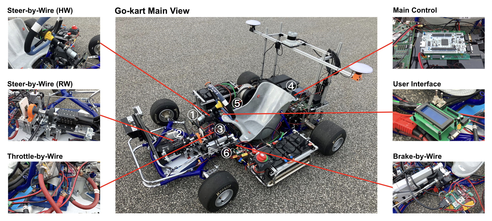

Welcome to XLAB's documentation!
===================================

Autonomous Go-Kart Project under Autoware Foundation

We have our documentation hosted on Read the Docs.

**Lumache** (/lu'make/) is a Python library for cooks and food lovers
that creates recipes mixing random ingredients.
It pulls data from the `Open Food Facts database <https://world.openfoodfacts.org/>`_
and offers a *simple* and *intuitive* API.

Check out the :doc:`NUCELO-F439ZI` section for further information, including
how to :ref:`usage`
:doc:`installation` the project.

.. note::

   This project is under active development.

Contents
--------

.. toctree::

   usage
   api
