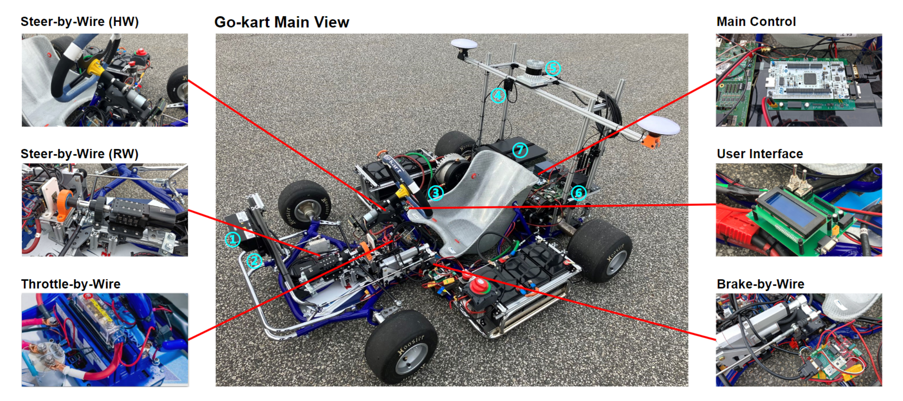

Tutorial
==============

.. In this page, we will document the whole process on how to build the Gokart project from scratch. We will go through the whole Electrical & Mechanical pipeline and then move on to testing the stack by running pre-build software algorithms.
.. The tutorial is structured such that the researcher/student looking to build this platform has an overview of the whole system and at the same time deep dive into any particular category of interest at any point in time.

Versions 
-----------------

* 1.0: Initial version : Purchased from TopKart 

.. image:: Build-the-Kart/imgs/topkart.png
   :width: 500
   :alt: TopKart
   
* 2.0: 2022 version : Autonomous reactive Gokart 

* 3.0: 2023 version : Autonomous Gokart 

.. image:: Build-the-Kart/imgs/avev_gokart.png
   :width: 500
   :alt: AVEV

Make your own Autonomous Go-kart (Steps)
-----------------

Following steps take you to individual sections of the tutorial:

1. **Step 1** :doc:`Bom`    
    
2. **Step 2** :doc:`soft_req`

    a. SolidWorks
    b. VSCode or editor of your choice
    c. STM32CubeIDE
    d. VESC tool
    e. Altium Designer
    f. 3D printer software like MakerBot
    
3. **Step 3** : :doc:`vehicle_assembly`
    
    a. Build the TopKart
    b. Test manual control
    c. Remove the motor
    d. Remove the front and rear plastic bumps
    e. Remove steering system

4. **Step 4** : Subsystem designs 
    a. :doc:`Build-the-Kart/TBW` (TBW) 
        * :doc:`Build-the-Kart/Mechanical/TBW_mechanical`
        * :doc:`Build-the-Kart/Electrical/TBW_electrical`
        * Unit testing
    b. :doc:`Build-the-Kart/BBW` (BBW)
        * :doc:`Build-the-Kart/Mechanical/BBW_mechanical`
        * :doc:`Build-the-Kart/Electrical/BBW_electrical`
        * Unit testing
    c. :doc:`Build-the-Kart/SBW` (SBW)
        * Upper Steer Assembly 
            + :doc:`Build-the-Kart/Mechanical/USBW_mechanical`
            + :doc:`Build-the-Kart/Electrical/USBW_electrical`
            + Unit testing
        * Lower Steer Assembly
            + :doc:`Build-the-Kart/Mechanical/LSBW_mechanical`
            + :doc:`Build-the-Kart/Electrical/LSBW_electrical`
            + Unit testing
    d. :doc:`Build-the-Kart/Electrical/MCU_electrical` (Main Control Unit)
    e. :doc:`Build-the-Kart/Mechanical/Power_mechanical` 
    f. Power Distribution Unit (PDU)
        * :doc:`Build-the-Kart/Electrical/PDU`
        * Unit testing
    g. Rear shelf design (RSD)
        * :doc:`Build-the-Kart/Mechanical/RSD_mechanical`
        * Unit testing

5. **Step 5** : Vehicle System Integration - Putting it all together!
    a. :doc:`Build-the-Kart/Software/Compute`
    b. :doc:`Build-the-Kart/Software/Communication`
    c. :doc:`Build-the-Kart/Software/MCU`
    d. :doc:`Build-the-Kart/Software/Control`

6. **Step 6 : Testing**
